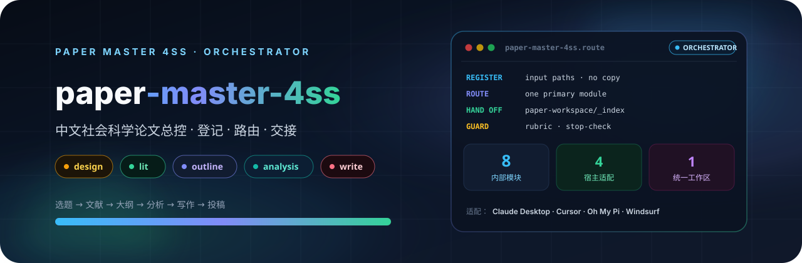

<p align="center">
  
</p>

# Paper Master 4SS

中文社会科学论文的总控 skill。它登记你给出的材料路径，判断当前该走哪一步，再路由到内部模块：研究设计、文献综述、大纲、数据分析、写作、投稿。产物统一写进项目里的 `paper-workspace/`。

适用场景：不知道下一步、想整理论文项目状态，或要把设计—文献—大纲—分析—写作—投稿串成一条可交接的流程。

## 4SS 家族

本仓库是**单一事实源**。七个业务模块可以单独安装，也可以只装总控（内部已自包含）。独立包由 `scripts/export_standalone.py` 导出，不要直接改独立仓库。

| 包 | 职责 | 默认输出 |
|---|---|---|
| **[paper-master-4ss](https://github.com/JingYangYuan/paper-master-4ss)** | 登记输入、选模块、维护索引与质量分 | `paper-workspace/_index/` |
| [paper-design-4ss](https://github.com/JingYangYuan/paper-design-4ss) | 选题、框架路由、研究设计蓝图 | `01-design/` |
| [paper-lit-4ss](https://github.com/JingYangYuan/paper-lit-4ss) | 中英文检索、文献地图、空白与假设 | `02-literature/` |
| [paper-outline-4ss](https://github.com/JingYangYuan/paper-outline-4ss) | 素材转大纲、证据映射、缺口报告 | `03-outline/` |
| [paper-analysis-4ss](https://github.com/JingYangYuan/paper-analysis-4ss) | 定量 / 质性 / 混合，Stata · R · Python | `04-analysis/` |
| [paper-write-4ss](https://github.com/JingYangYuan/paper-write-4ss) | 章节写作、润色、语言扫描、正文净稿 | `05-writing/` |
| [paper-submission-4ss](https://github.com/JingYangYuan/paper-submission-4ss) | Word 导出、体例、投稿清单与信函 | `06-submission/` |
| [paper-update-4ss](https://github.com/JingYangYuan/paper-update-4ss) | 待审核更新包，不直接改核心文件 | `07-update/` |

用户层路径：

```text
定位选题 → 文献定位 → 结构成型 → 分析/材料验证（按需） → 正文写作 → 投稿整备
```

`analysis` 只在设计蓝图标明需要经验验证时进入。理论、规范或阐释路径从大纲直接进写作。

## 安装

把本目录放到宿主的 skill 目录后即可调用。入口是 `SKILL.md`。

```bash
git clone https://github.com/JingYangYuan/paper-master-4ss.git
```

常见落点：Claude Code / Claude Desktop 的 skills 目录、Cursor 的 skills 目录、Oh My Pi 的 skill 目录。具体路径以宿主文档为准。

首次在某个论文项目里使用时，先建工作区：

```bash
mkdir -p paper-workspace/{00-meta,01-design,02-literature,03-outline,04-analysis,05-writing,06-submission,07-update,_logs,_logs/hook-audit,_index}
```

依赖按目标模块验收，说明见 `references/install-dependencies.md`。缺依赖时停止路由，不假装已经跑通。

| 模块 | 外部依赖 |
|---|---|
| design / outline / update | 无强制外部依赖 |
| lit | CNKI 需要可见浏览器控制；Zotero MCP 可选 |
| analysis | 按所选语言：Stata / R / Python |
| write | Python 3（扫描脚本） |
| submission | pandoc（Markdown → Word） |

## 它怎么工作

总控只做三件事：登记材料、选择一个主模块、把交接写进索引。

1. 读 `references/runtime-adapter.md`，把当前宿主工具映射成通用能力。
2. 读 `master/routing-matrix.md` 选主模块；需要顾问时再读 `master/agent-orchestration.md`。
3. 执行对应 `modules/<module>/SKILL.md`。
4. 更新 `_index/project-state.md`、`handoff-status.md`、`paper-roadmap.md`。
5. 跑 `scripts/paper_master_guard.py score-project`，写入质量分。

顾问按决策风险派发，不因模块名自动拉满名单。当前宿主不能并行时，按同一角色顺序复核，并记录 `sequential-review`。

## 工作区索引

| 文件 | 用途 |
|---|---|
| `_index/project-state.md` | 主题、阶段、产物、缺口 |
| `_index/input-registry.md` | 用户提供的路径（只登记，不搬运） |
| `_index/handoff-status.md` | 阶段交接与未解决风险 |
| `_index/paper-roadmap.md` | 给用户看的路径图和下一步 |
| `_index/quality-score.md` | 阶段质量分与全流程成熟度 |

完整目录约定见 `master/workspace-contract.md`。

## 宿主

适配 Claude Code / Claude Desktop、Cursor、Oh My Pi、Windsurf，以及 OpenCode、Codex、ZCode。工具名以 `references/agent-software-adapters.md` 为准。

ZCode 不执行 skill frontmatter hooks。首次在 ZCode 里调用本包时运行：

```bash
python3 scripts/register_zcode_hooks.py
```

查询 `--check`，撤销 `--remove`。

## 导出独立包

修改 `modules/<module>/` 后，从总控根目录导出：

```bash
python3 scripts/export_standalone.py            # 全部
python3 scripts/export_standalone.py lit write  # 指定模块
python3 scripts/export_standalone.py --check    # 只检查路径
```

导出结果写到与本包同级的 `paper-<module>-4ss/`。独立包里的 `master/`、部分 `references/` 是快照；跨模块路径仍指向同级安装的 `paper-master-4ss/`。

## 目录

```text
paper-master-4ss/
├── SKILL.md                 # 总控入口
├── master/                  # 路由、顾问、输出、工作区协议
├── modules/
│   ├── design/
│   ├── lit/
│   ├── outline/
│   ├── analysis/
│   ├── write/
│   ├── submission/
│   └── update/
├── references/              # 宿主适配、依赖、评分、顾问注册表
├── scripts/                 # guard、ZCode hook 注册、导出
└── docs/banner.svg
```

协议入口：`master/routing-matrix.md`、`master/agent-orchestration.md`、`master/output-protocol.md`、`master/user-journey.md`、`master/literature-review-protocol.md`。

## License

[MIT](LICENSE)
