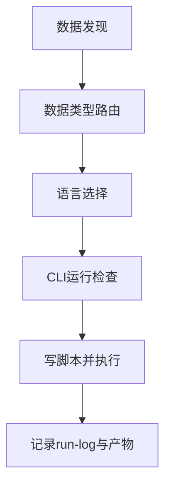
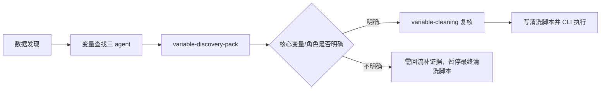

# Phase 01: 初始化与路由

本 phase 的分析计划、流程日志摘要和 agent synthesis 必须遵守 `master/output-protocol.md`。数据发现、语言选择、CLI 检查和后续 phase 路由必须包含 Mermaid 图示，例如：



图后用 2-4 条中文解释说明数据来源、语言选择理由、执行阻断和不可声称边界。

## 0. 顾问派发闸门

完成数据发现和数据类型路由后，结构化数据任务必须先派发 3 个变量查找 agent：`modules/analysis/agents/variable-inventory-consultant.md`、`modules/analysis/agents/variable-role-mapping-consultant.md`、`modules/analysis/agents/variable-quality-consultant.md`。三者可并行；若环境不能真实并行，按顺序复核并在 synthesis 中记录 `sequential-review`。主流程综合三者输出为 `paper-workspace/04-analysis/reports/variable-discovery-pack-[YYYY-MM-DD].md`。

只有在发现包没有核心变量或角色歧义，或已把歧义明确列入“需回流补证据”后，才派发 `modules/analysis/agents/variable-cleaning-consultant.md`，复核变量清洗、样本口径、缺失和异常值处理。若任务包含建模、因果识别或面板/政策冲击，立即追加 `modules/analysis/agents/identification-model-consultant.md` 做识别预判。意见写入 `paper-workspace/_logs/agents/analysis-[YYYY-MM-DD]/`，并生成 `agent-synthesis-analysis-[YYYY-MM-DD].md`。



- 变量查找先于清洗脚本，避免主流程凭字段名直接构造分析变量。
- 发现包必须保留变量来源、角色映射、质量风险和待确认项。
- 若变量角色不明确，只能交付发现包和确认问题，不得声称完成清洗。

## 1. 环境与目录

创建目录并初始化日志：

```bash
OUTPUT_ROOT="${OUTPUT_ROOT:-paper-workspace/04-analysis}"
mkdir -p "$OUTPUT_ROOT"/{data,scripts,tables,figures,reports,qual/codebooks,qual/coded-data,qual/memos,qual/anonymized,qual/reliability}
mkdir -p paper-workspace/_logs
LOG_FILE="paper-workspace/_logs/process-log-analysis-$(date +%Y-%m-%d).md"
if [ ! -f "$LOG_FILE" ]; then
  printf "# Process Log: modules/analysis\n\n| Time | Step | Decision | Output |\n|---|---|---|---|\n" > "$LOG_FILE"
fi
```

## 2. 数据发现

若用户未给路径，先读取 `paper-workspace/_index/input-registry.md`，再扫描当前项目目录：

```bash
test -f paper-workspace/_index/input-registry.md && sed -n '1,120p' paper-workspace/_index/input-registry.md
find . -maxdepth 4 -type f \( -name "*.csv" -o -name "*.xlsx" -o -name "*.dta" -o -name "*.sav" -o -name "*.rds" -o -name "*.parquet" -o -name "*.txt" -o -name "*.md" -o -name "*.docx" \) 2>/dev/null | head -80
```

候选较多时，按最近修改时间、文件名中的 `clean`、`analysis`、`访谈`、`transcript`、`data`、`panel` 优先。

## 3. 数据类型路由

| 输入 | 路由 |
|---|---|
| CSV/XLSX/DTA/SAV/RDS/Parquet | 定量清洗与基础回归 |
| 多波次或含 id/time | 面板检查 + FE/RE/DiD 可能路径 |
| 访谈/田野/开放题/政策文本 | 质性匿名化 + 编码/主题/内容分析 |
| 定量结果 + 质性材料 | 混合方法 |

## 4. 语言选择

| 条件 | 默认语言 |
|---|---|
| 用户明确指定 | 用户指定 |
| `.dta`、Stata 项目、要求 esttab/putdocx | Stata |
| 通用清洗、固定效应、论文表图 | R |
| 文本分段、批量编码、机器学习、Python 项目 | Python |

记录语言选择及理由。若同一项目用多语言，必须生成 `script-index.md` 说明运行顺序。

## 4.1 运行时检查

语言选择后、写脚本前，必须检查对应执行通道是否可用；Stata 检查宿主的 Stata MCP（statamcp），不可用时按 `modules/analysis/references/stata-ecosystem-setup.md` §1 安装配置后再验。

Stata（statamcp）：

1. 调用 `stata_session`（action=list）确认 MCP 可达与会话状态；`multi_session_enabled` 时记录可用会话数。
2. 用 `stata_run_selection` 执行 `display 1+1`，返回 `2` 即通道就绪；把验证结果记入 run-log。
3. 验收不通过时按 `modules/analysis/references/stata-ecosystem-setup.md` §1 安装配置 statamcp；仍失败则记录环境阻断。

```bash
RUN_LOG="paper-workspace/04-analysis/reports/run-log-$(date +%Y-%m-%d).md"
mkdir -p paper-workspace/04-analysis/reports
case "$LANGUAGE" in
  r) command -v Rscript || echo "未找到 Rscript；按 modules/analysis/references/r-ecosystem-setup.md 安装 R" ;;
  python) command -v python3 || echo "未找到 python3；按 modules/analysis/references/python-ecosystem-setup.md 安装 Python" ;;
  # stata：走上方 statamcp 三步验收，安装配置见 stata-ecosystem-setup.md
esac
```

所有后续 phase 写出的 `.do`、`.R`、`.py` 都必须立即执行——Stata 经 `stata_run_file`，R/Python 用 `Rscript`/`python3`——并把调用、返回输出/退出码、stdout/stderr 路径和产物写入 `run-log-[date].md`。无法执行时只能记录阻断原因，不得伪造结果或显著性。

## 5. 安全门控

结构化数据：只在输出中打印汇总统计，不泄露原始行级敏感信息。  
质性材料：访谈、田野笔记、开放题文本必须先走匿名化流程，真实身份映射表不得被读取、复制到报告或提交给 AI。

## 6. 最低信息要求

定量回归至少需要：数据路径、因变量、核心自变量。控制变量、固定效应、聚类层级可以从研究设计推断，但推断要记录。  
质性分析至少需要：文本路径、研究问题、分析单位。若用户只要求整理材料，默认做分段和编码本草案。
