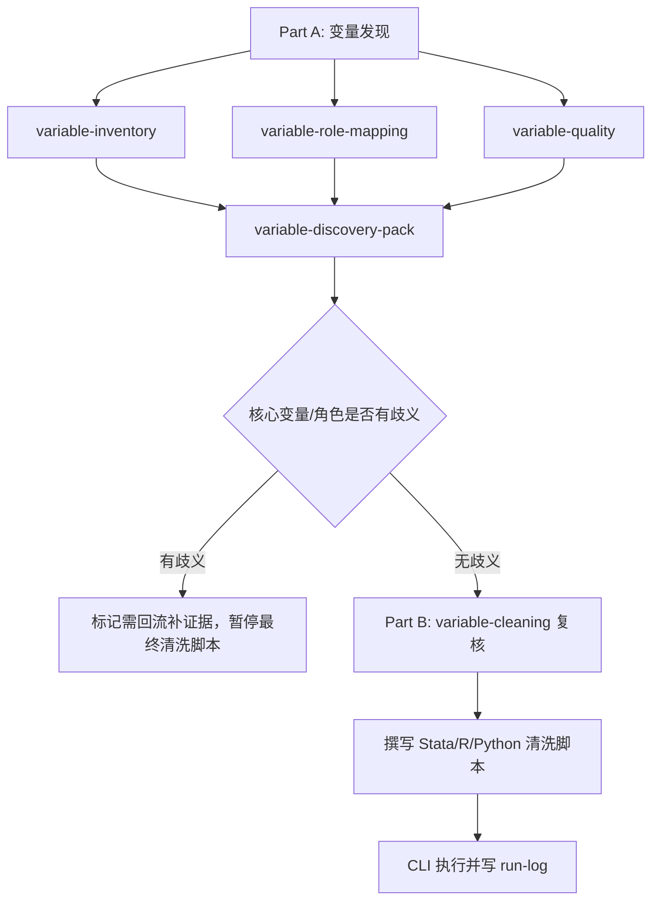

# Phase 02: 定量数据清洗与描述统计

## 1. 清洗原则

目标是构建论文分析数据，不做特定大型调查数据库的完整原始数据重构。所有清洗必须可复现、可审计、可回退。

本 phase 拆成两段执行：Part A 先由变量查找 agent 生成 `variable-discovery-pack`，Part B 再由 `variable-cleaning-consultant` 复核清洗方案，主流程据此撰写并 CLI 执行清洗脚本。



- Part A 的目标是发现变量、映射角色和预判质量风险，不直接生成最终清洗脚本。
- Part B 必须以发现包为输入，先复核清洗方案，再写脚本并执行。
- 任何统计数值、描述表和清洗完成声明都必须来自已成功执行的 CLI 产物。

## 2. Part A: 变量发现

### 2.1 强制派发变量查找 agent

在读取数据结构、变量标签、codebook、问卷或既有变量字典后，必须并行或顺序派发以下 3 个 agent：

| Agent | 文件路径 | 产出重点 |
|---|---|---|
| variable-inventory | `modules/analysis/agents/variable-inventory-consultant.md` | 候选变量、来源路径、字段含义风险 |
| variable-role-mapping | `modules/analysis/agents/variable-role-mapping-consultant.md` | Y/X/control/fe/cluster/weight/id/time/mechanism/mediator/moderator/heterogeneity/threshold/nonlinear/instrument/treatment/post/running/cutoff 映射和回流项 |
| variable-quality | `modules/analysis/agents/variable-quality-consultant.md` | 缺失、类型、异常值、重复、特殊缺失码、面板唯一性和样本口径风险 |

若当前环境不能真实并行，按上表顺序复核，并在 `agent-synthesis-analysis-[date].md` 中记录 `sequential-review`。三个 agent 的原始意见落盘到 `paper-workspace/_logs/agents/analysis-[date]/`。

### 2.2 变量发现包

主流程综合三位顾问意见，输出：

`paper-workspace/04-analysis/reports/variable-discovery-pack-[date].md`

发现包必须使用中文 Markdown，并至少包含：

| 板块 | 必填内容 |
|---|---|
| `## 参考库回查` | 顾问读取路径、采用框架、依据条款、参考缺口 |
| `## 候选变量清单` | 原始字段、标签/题项、来源路径、可能含义、字段风险 |
| `## 变量角色映射` | Y/X/control/fe/cluster/weight/id/time/mechanism/mediator/moderator/heterogeneity/threshold/nonlinear/instrument/treatment/post/running/cutoff 及置信度 |
| `## 数据质量预判` | 缺失、类型、异常值、重复、特殊缺失码、面板唯一性、样本口径 |
| `## 需回流补证据` | 核心变量、变量角色、题项含义、样本口径或数据文件歧义，以及应回到数据字段、codebook、问卷、清洗脚本或设计产物补证据的位置 |
| `## 进入清洗条件` | 哪些条件满足后可进入 Part B |

变量角色或核心变量有歧义时，发现包必须列为“需回流补证据”，并暂停最终清洗脚本撰写；只能交付发现包、回流任务和可执行的探查脚本，不得声称清洗完成。只有必要数据路径、codebook 或问卷完全缺失且无法从项目索引发现时，才请求用户补充最小材料。

## 3. Part B: 数据清洗

### 3.1 variable-cleaning 复核

进入清洗前，必须把 `variable-discovery-pack-[date].md`、数据路径、研究问题、回流补证据项和计划使用语言作为输入包，派发：

`modules/analysis/agents/variable-cleaning-consultant.md`

该 agent 复核样本筛选、缺失处理、异常值、变量字典和可执行清洗方案。主流程只能在复核后撰写 Stata/R/Python 清洗脚本。

### 3.2 必做检查

| 检查 | 输出 |
|---|---|
| 文件读取和编码 | 读取日志 |
| 变量存在性 | 核心变量清单 |
| 类型检查 | 数值/字符/日期/分类变量表 |
| 缺失检查 | 缺失比例表 |
| 异常值 | 极端值、非法值、箱线图或分位数表 |
| 重复值 | ID 或 ID-time 重复诊断 |
| 样本筛选 | 样本流失表 |
| 面板结构 | `id-time` 唯一性、波次数、平衡性 |

### 3.3 常规清洗动作

- 变量改名：保留原变量名到变量字典，清洗变量使用可读名称。
- 类型转换：金额、年龄、教育年限等转数值；日期转标准日期。
- 缺失值：将特殊缺失码显式转为缺失，记录规则。
- 异常值：优先报告和敏感性分析；去极值必须说明阈值。
- 分类变量：保留参考组和标签，记录合并小类规则。
- 连续变量：按理论需要取对数、标准化、中心化。
- 指数构造：分量方向统一，报告 Cronbach alpha 或构造逻辑。

## 4. 变量字典

必须输出 `variable-dictionary.csv`，字段至少包括：

| 字段 | 含义 |
|---|---|
| `raw_name` | 原始变量名 |
| `clean_name` | 清洗后变量名 |
| `display_name` | 对外表格、图轴和报告使用的可发表展示名 |
| `label` | 中文含义 |
| `role` | Y/X/control/fe/cluster/weight/id/time/mechanism/mediator/moderator/heterogeneity/threshold/nonlinear/instrument/treatment/post/running/cutoff |
| `type` | numeric/categorical/text/date |
| `missing_rule` | 特殊缺失码和处理规则 |
| `transform` | 取对数、标准化、反向计分、合成指数等 |
| `source_file` | 来源文件 |
| `notes` | 口径说明和限制 |

变量字典不要求一次完美，但所有进入模型的变量必须有记录。

## 5. 样本流失表

样本流失表按“可复现筛选步骤”而非自然语言摘要生成：

| step | rule | n_before | n_after | dropped | reason |
|---|---|---:|---:|---:|---|
| 0 | 原始数据 |  |  |  | 原始样本 |
| 1 | 保留合格研究对象 |  |  |  | 研究对象界定 |
| 2 | 非缺失_因变量 |  |  |  | 因变量缺失 |
| 3 | 非缺失_核心解释变量 |  |  |  | 核心解释变量缺失 |
| 4 | 非缺失_控制变量 |  |  |  | 控制变量缺失 |
| 5 | valid panel/id-time |  |  |  | 面板唯一性 |

如果同一论文需要多个分析样本，分别输出 `sample-flow-main.csv`、`sample-flow-robustness.csv` 或在 `sample_id` 字段区分。

## 6. 描述统计

输出：

- Table 1：均值、标准差、最小值、最大值、N；分类变量给比例。
- 分组描述：按处理组、性别、城乡、年份或核心分组。
- 相关矩阵：仅用于描述，不作为因果证据。
- 基础图：结果变量分布、核心自变量分布、分组均值图。

所有导出的描述统计保留 3 位小数；N 和频数保留整数。

## 7. 数据质量诊断

清洗报告至少回答：

- 核心变量缺失是否集中在某些群体或年份。
- 极端值是否来自录入错误、真实极端还是单位混乱。
- 分类变量是否存在小样本类别，是否需要合并。
- 面板数据是否有重复 id-time，是否存在严重不平衡。
- 权重变量是否可用，权重为 0 或缺失的样本如何处理。
- 清洗动作是否改变主要样本结构。

## 8. 三语言实现

- Stata：参考 `modules/analysis/templates/stata-analysis-template.do` 的读取、样本标记和描述统计段。
- R：参考 `modules/analysis/templates/r-analysis-template.R` 的 `load_data()`、`clean_data()`、`make_table1()`。
- Python：参考 `modules/analysis/templates/python-analysis-template.py` 的 `load_data()`、`clean_data()`、`describe_data()`。

## 8.1 清洗脚本执行门槛

生成清洗或描述统计脚本后必须立即实际执行：

```bash
# Stata：statamcp —— stata_run_file(
#   file_path="paper-workspace/04-analysis/scripts/cleaning.do",
#   working_dir=<.do 相对路径基准目录>, timeout=按需)

# R
Rscript "paper-workspace/04-analysis/scripts/cleaning.R"

# Python
python3 "paper-workspace/04-analysis/scripts/cleaning.py"
```

执行结果写入 `paper-workspace/04-analysis/reports/run-log-[date].md`，Stata 记录 statamcp 调用与返回输出（或 CLI 命令）、失败信号与产物路径；必须包含生成的 `analysis-data.*`、变量字典、描述统计表和样本流失表。未执行成功时，不得声称清洗完成或引用描述统计数值。

## 9. 输出文件

保存到：

- `paper-workspace/04-analysis/data/analysis-data.*`
- `paper-workspace/04-analysis/data/variable-dictionary.csv`
- `paper-workspace/04-analysis/tables/table1-descriptives.*`
- `paper-workspace/04-analysis/tables/sample-flow.csv`
- `paper-workspace/04-analysis/reports/cleaning-report-[date].md`
