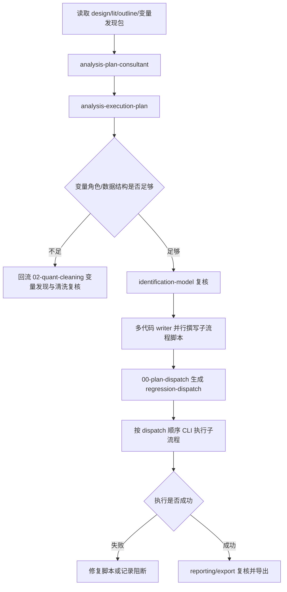

# Phase 03: 模型执行、扩展检验与结果表

本 phase 的模型决策记录、分析执行计划、扩展检验说明和结果摘要必须遵守 `master/output-protocol.md`。回归流程不再固定为“描述统计→主回归→稳健性”，而是读取 design、lit、outline 和变量发现包中的完整变量蓝图，自动执行所有已经设定的分析环节。



- `analysis-execution-plan` 是本 phase 的硬入口；没有该计划不得直接写回归脚本。
- 中介、机制、调节、异质性、门槛、非线性、交互、分组、DiD、IV、RDD、PSM、面板等只要在 design 或变量发现包中出现，就必须进入执行计划。
- 信息不足时回流到清洗与变量发现流程，不询问用户补选模型选项。

## 0. 顾问派发闸门

建模前必须派发 `modules/analysis/agents/analysis-plan-consultant.md`，从以下位置抽取完整分析蓝图：

- `paper-workspace/01-design/`
- `paper-workspace/02-literature/`
- `paper-workspace/03-outline/`
- `paper-workspace/04-analysis/reports/variable-discovery-pack-[date].md`
- `paper-workspace/04-analysis/data/variable-dictionary.csv`
- `paper-workspace/04-analysis/reports/cleaning-report-[date].md`

随后必须派发 `modules/analysis/agents/identification-model-consultant.md` 复核模型和识别路径。代码撰写阶段派发以下 writer；可并行，不能并行时按顺序执行并记录 `sequential-review`：

| Writer | 文件路径 | 覆盖任务 |
|---|---|---|
| main-regression-code-writer | `modules/analysis/agents/main-regression-code-writer.md` | 描述统计、Table 1、基准模型、主回归、基础诊断 |
| mechanism-extension-code-writer | `modules/analysis/agents/mechanism-extension-code-writer.md` | 中介、机制、调节、异质性、门槛、非线性、交互、分组、边际效应图 |
| causal-robustness-code-writer | `modules/analysis/agents/causal-robustness-code-writer.md` | DiD、事件研究、IV、RDD、PSM/CEM/IPW、面板、稳健性、安慰剂 |
| export-reporting-code-writer | `modules/analysis/agents/export-reporting-code-writer.md` | 表格、图形、`script-index.md`、结果报告、质量门控导出 |

主模型和扩展模型生成后，继续派发 `modules/analysis/agents/robustness-consultant.md` 与 `modules/analysis/agents/result-reporting-consultant.md` 复核。所有顾问意见进入 `paper-workspace/_logs/agents/analysis-[YYYY-MM-DD]/` 和 `agent-synthesis-analysis-[YYYY-MM-DD].md`。

## 1. 分析执行计划

主流程综合 `analysis-plan-consultant` 输出，生成：

`paper-workspace/04-analysis/reports/analysis-execution-plan-[date].md`

执行计划必须使用中文 Markdown，并至少包含：

| 板块 | 必填内容 |
|---|---|
| `## 来源回查` | 已读取的 design、lit、outline、analysis 产物路径 |
| `## 变量角色表` | `Y/X/control/fe/cluster/weight/id/time/mechanism/mediator/moderator/heterogeneity/threshold/nonlinear/instrument/treatment/post/running/cutoff` |
| `## 假设与机制链` | design/lit 中的 H1/H2、机制链、理论变量和可检验路径 |
| `## 模型执行任务表` | 描述统计、主回归、中介、机制、调节、异质性、门槛、非线性、识别设计、稳健性、导出 |
| `## 代码派发表` | 每个 writer 的输入包、输出片段、合并顺序和产物路径 |
| `## 回流清洗项` | 变量不存在、角色冲突、样本口径不清、数据结构不足、CLI 阻断 |

变量角色或数据结构不足时，不询问用户选择模型；必须把缺口写入“回流清洗项”，回到 `02-quant-cleaning.md` 的 Part A/Part B 重新补证据或生成阻断说明。

## 2. 模型路由与执行范围

先读取 `modules/analysis/references/quantitative-model-router.md` 和 `modules/analysis/references/quantitative-reporting-standards.md`。模型执行范围由 `analysis-execution-plan` 决定。

| 设计蓝图信号 | 必须进入的执行任务 |
|---|---|
| `Y/X/control/fe/cluster/weight` | 描述统计、主回归、基础诊断、Table 1/2 |
| `mediator` 或中介假设 | 中介路径、间接效应、bootstrap 或可替代的机制证据 |
| `mechanism` | 机制变量回归、机制链证据、替代机制排除 |
| `moderator` 或调节假设 | 交互项、简单斜率、边际效应图 |
| `heterogeneity` 或分组理论 | 分组回归、组间差异检验、异质性表 |
| `threshold` | 门槛模型、分段回归、阈值敏感性或不可执行阻断 |
| `nonlinear` | 二次项、样条、分位数、非线性边际效应或预测概率 |
| `instrument` | 第一阶段、弱工具、2SLS、过识别或排除限制说明 |
| `treatment/post` | DiD、事件研究、平行趋势、安慰剂和窗口敏感性 |
| `running/cutoff` | RDD、带宽、操纵检验、协变量平衡、placebo cutoff |
| `id/time` 或面板结构 | FE/RE、Hausman、双向固定效应、面板诊断、聚类标准误 |
| PSM/CEM/IPW 设计 | 倾向得分、平衡性、共同支撑、匹配/加权后回归 |

不得把中介、机制、调节、异质性和门槛笼统写成“可选稳健性”。只要变量蓝图中出现对应角色，就必须执行或明确记录不可执行阻断。

## 3. 模型决策记录

运行任何模型前，生成或追加：

`paper-workspace/04-analysis/reports/model-decision-[date].md`

每个模型块至少记录：

```markdown
## 模型决策：[任务名/模型名]

- 来源设计:
- 对应假设:
- 变量角色:
- 因变量类型:
- 数据结构:
- 模型选择:
- 标准误/聚类层级:
- 固定效应/权重:
- 诊断与质量门控:
- 可声称内容:
- 不可声称内容:
- 回流清洗项:
```

模型选择必须追溯到 `quantitative-model-router.md`；报告呈现必须追溯到 `quantitative-reporting-standards.md`。

## 4. 多 Agent 代码撰写与子流程执行

代码 writer 只输出代码草案、依赖、输入输出路径和风险，不直接声称结果。主流程不再合并成一个超长回归脚本，而是按 `templates/03-regression/README.md` 的子流程结构复制或改写脚本，并由 `00-plan-dispatch` 生成派发表：

- `paper-workspace/04-analysis/scripts/00-plan-dispatch/`
- `paper-workspace/04-analysis/scripts/01-main-models/`
- `paper-workspace/04-analysis/scripts/02-nonlinear/`
- `paper-workspace/04-analysis/scripts/03-panel/`
- `paper-workspace/04-analysis/scripts/04-causal/`
- `paper-workspace/04-analysis/scripts/05-mechanism-heterogeneity/`
- `paper-workspace/04-analysis/scripts/06-robustness/`
- `paper-workspace/04-analysis/scripts/07-regression-export/`

执行顺序固定为：

1. `00-plan-dispatch` 读取 `analysis-execution-plan-[date].md`、变量字典和清洗报告，生成 `model-decision-[date].md` 与 `regression-dispatch.json/csv`；不运行统计模型。
2. `01-main-models` 执行描述统计、Table 1、OLS/基准模型、基础诊断和主回归。
3. `02-nonlinear` 仅在 dispatch 触发时执行 Logit、Probit、Poisson、Tobit、Heckman、有序/多分类模型，并输出边际效应或预测概率。
4. `03-panel` 仅在 `id/time/fe/cluster` 等角色足够时执行 FE/RE、Hausman、双向固定效应、动态 GMM、面板 IV 和面板诊断。
5. `04-causal` 按计划触发 IV/2SLS/GMM、DID/事件研究、多期 DID、RDD、PSM/CEM/IPW 和 SCM。
6. `05-mechanism-heterogeneity` 执行中介、机制、调节、异质性、门槛、非线性、交互和分组检验；不得并入稳健性。
7. `06-robustness` 只执行 dispatch 中明确列出的替代变量、替代样本、替代模型、标准误/聚类、安慰剂和敏感性任务。
8. `07-regression-export` 汇总表格、图形、`script-index.md`、缺失产物报告和 `regression-results-[date].md`；不重新估计模型。

不得再把主回归、机制、因果识别、稳健性和导出塞进单个长脚本。若某个子流程因变量缺失、数据结构不足或依赖不可用不能执行，必须写入 `run-log-[date].md`、`regression-dispatch.csv` 或缺失产物报告，不得静默跳过。

所有回归、扩展检验、因果识别和稳健性表默认写入 `paper-workspace/04-analysis/tables/*.csv`。CSV 不是长表字段摘要，必须采用论文宽表结构：首列为变量/统计项，后续列为模型编号 `(1)`、`(2)`、`(3)`、`(4)` 等；第二表头行写每列因变量或模型标签；每个变量两行，第一行是系数/边际效应和显著性星号，第二行是括号内 t/z 值；不适用的单元格用 `-`。所有控制变量必须逐行列报；固定效应用中文行名如“省份固定”“年份固定”“个体固定”汇总为“是/否”；表尾至少包含“观测值”，并在适用时包含 `R²`、`调整 R²`、`Pseudo R²`、`Within R²`。标准误类型、聚类层级、权重和显著性规则写入 CSV 末尾“注：”行。HTML、TeX、DOCX 只在用户要求、投稿整备或期刊格式需要时附加导出。

文档和模板示例必须使用泛化占位名，避免固化某个项目的具体变量名称。真实项目导出表格、图轴和结果报告时，使用可发表展示名：优先采用变量字典中的 `display_name`，其次采用数据标签或清洗后的变量名；不得把真实输出强制替换为“因变量”“核心解释变量”“控制变量1”等角色名。

## 5. 诊断与回流规则

诊断失败时按以下顺序处理：

1. 回查清洗报告和变量发现包，确认变量存在、类型、缺失、异常值、样本口径和面板唯一性。
2. 回流 `02-quant-cleaning.md` Part A/Part B，补充 `variable-discovery-pack` 或清洗脚本。
3. 修复合并脚本并重新执行。
4. 若数据、CLI、许可或必要变量仍缺失，记录阻断和不可声称内容。

禁止在回归阶段停下来要求用户从多个模型选项中选择。用户没有明确要求中断时，主流程必须从描述统计一直推进到导出门控；任何不能执行的环节写成阻断、回流任务或限制。

## 6. 建模脚本执行门槛

生成主模型、扩展检验、因果识别、稳健性、异质性、机制、调节、门槛、非线性或导出脚本后，必须立即实际执行（Stata 经 statamcp 的 `stata_run_file`）：

```bash
# Stata 示例：statamcp —— stata_run_file(
#   file_path="paper-workspace/04-analysis/scripts/01-main-models/main_models.do",
#   working_dir=<.do 相对路径基准目录>,
#   timeout=1800,  # 重回归显式调大（默认 600 秒）
#   session_id=并行子流程各用独立 ID)

# R 示例
Rscript "paper-workspace/04-analysis/scripts/01-main-models/main_models.R"

# Python 示例
python3 "paper-workspace/04-analysis/scripts/01-main-models/main_models.py"
```

把 statamcp 调用与返回输出（或 CLI 命令与路径）、失败信号、模型表、图形产物和失败原因写入 `paper-workspace/04-analysis/reports/run-log-[date].md`。只有无失败信号且产物存在时，才能在 `regression-results-[date].md` 中写统计结论；否则只能写阻断原因、修复步骤和未能声称的内容。

## 7. 输出文件

- `reports/analysis-execution-plan-[date].md`
- `reports/model-decision-[date].md`
- `reports/regression-dispatch.json`
- `reports/regression-dispatch.csv`
- `scripts/00-plan-dispatch/*`
- `scripts/01-main-models/*`
- `scripts/02-nonlinear/*`
- `scripts/03-panel/*`
- `scripts/04-causal/*`
- `scripts/05-mechanism-heterogeneity/*`
- `scripts/06-robustness/*`
- `scripts/07-regression-export/*`
- `tables/table1-descriptives.csv`
- `tables/table2-main-regression.csv`
- `tables/table3-nonlinear-marginal-effects.csv`
- `tables/table3-mechanism-mediation-moderation.csv`
- `tables/table4-heterogeneity-threshold-nonlinear.csv`
- `tables/tableA-panel-models.csv`
- `tables/tableA-robustness.csv`
- `tables/tableA1-causal-robustness.csv`
- `figures/coefplot-main.*`
- `figures/marginal-effects.*`
- `figures/event-study.*`
- `figures/mechanism-or-threshold.*`
- `reports/regression-results-[date].md`
- `reports/script-index.md`
