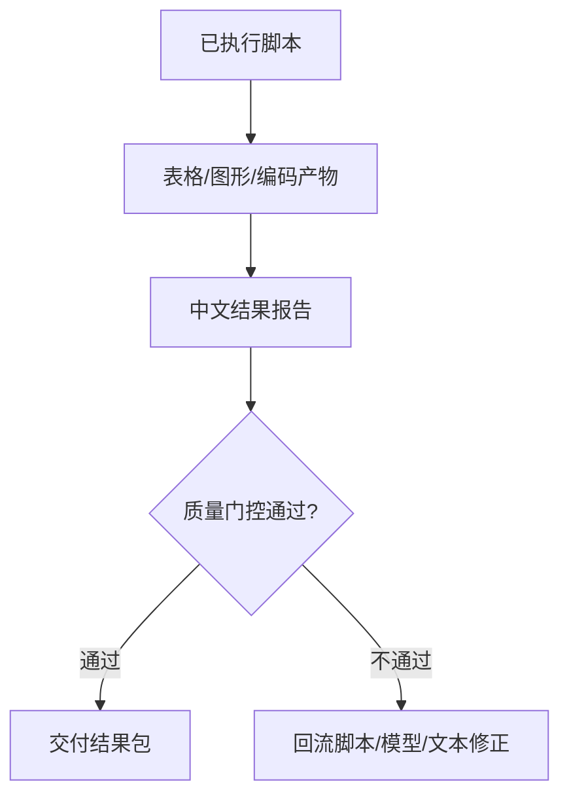

# Phase 06: 导出与质量门控

本 phase 的结果报告和质量门控摘要必须遵守 `master/output-protocol.md`。导出、报告、门控和回流路径必须包含 Mermaid 图示，例如：



图后用 2-4 条中文解释说明产物来源、质量门控状态、回流项和残余风险。

## 0. 顾问派发闸门

导出表格、图形和结果报告前，必须派发 `modules/analysis/agents/result-reporting-consultant.md`，复核论文级表图、统计解释、质性摘录呈现和中文结果段落。未通过项必须写入 `agent-synthesis-analysis-[YYYY-MM-DD].md` 和 `reports/results-brief.md` 的限制部分。

## 1. 表格导出

默认导出格式为 CSV。所有描述统计表、模型表、机制/中介/调节/异质性表、因果识别表、稳健性表、质性表和 mixed joint display 都必须保存 CSV；HTML、TeX、DOCX 只作为用户明确要求、投稿整备或期刊模板需要时的附加格式，不得替代 CSV。

| 表 | 内容 |
|---|---|
| Table 1 | 描述统计和样本特征 |
| Table 2 | 主回归 |
| Table 3 | 边际效应、机制或异质性 |
| Appendix A | 稳健性 |
| Qual Table | 编码频次、主题、信度 |
| Joint Display | 混合方法整合 |

表格命名规则：

- 主文表：`table1-*`、`table2-*`、`table3-*`。
- 附录表：`tableA1-*`、`tableA2-*`。
- 质性表：`qual-table-*`。
- 混合方法表：`joint-display-*`。

每个表格必须能在 `script-index.md` 中找到生成脚本。

### 1.1 回归 CSV 宽表结构

回归类 CSV 必须保留论文宽表结构，而不是导出长表字段摘要。默认形态如下：

```csv
表4基准回归,,,,
,(1),(2),(3),(4)
因变量A,因变量B,因变量A,因变量B
参考类别（基期）,-,-,-,-
核心解释变量类别1,1.150***,0.119,1.151***,0.115
,(7.494),(0.637),(7.538),(0.616)
控制变量1,-,-,-1.641***,0.487***
,-,-,(-16.525),(6.484)
省份固定,是,是,是,是
观测值,15133,15133,15133,15133
注：*** p<0.01，** p<0.05，* p<0.1，括号内为t值，聚类到家庭层面，下同。,,,,
```

硬性要求：

- 第一行写中文表题，如“表4基准回归”。
- 第二行写模型编号 `(1)`、`(2)`、`(3)`、`(4)`；第三行写每列因变量名或模型标签。
- 核心变量、机制变量、中介变量、调节变量、异质性变量和所有控制变量逐行列报。
- 每个变量默认两行：系数/边际效应行 + 括号内 t/z 值行；不适用的单元格用 `-`。
- cut 点、阈值、截距、常数等模型特有参数按普通变量行保留，如 `cut1`、`cut2`、`常数`。
- 固定效应不展开虚拟变量，但必须在表尾以中文行名写明，如“省份固定”“年份固定”“个体固定”，取值为“是/否”。
- 表尾必须保留“观测值”；`R²`、`调整 R²`、`Pseudo R²`、`Within R²` 只在模型适用时输出，不适用时不强制保留空行。
- 标准误类型、聚类层级、权重、参考组和显著性规则写入最后的“注：”行。
- 文档和模板示例使用泛化占位名；真实项目表格使用 `display_name`、数据标签或清洗后的变量名，不按角色强制替换。

## 2. 图形导出

保存 PDF 和 PNG：

- 变量分布图。
- 系数图。
- 边际效应或预测概率图。
- DiD 事件研究图。
- 编码频次图。
- 编码共现热图。
- 主题图或范畴关系图。

图形要求：

- PDF 用于论文排版，PNG 用于快速预览。
- 坐标轴必须有中文或清晰英文标签。
- 边际效应图必须标注置信区间。
- 事件研究图必须标出政策发生点和基准期。

## 3. 中文结果报告

报告必须包含：

1. 数据与样本。
2. 变量构造。
3. 描述统计要点。
4. 模型设定。
5. 主结果。
6. 稳健性与异质性。
7. 质性主题或内容分析发现。
8. 混合方法整合。
9. 限制与不可推断内容。

报告文件建议结构：

```markdown
# 分析结果报告

## 数据与样本
## 变量与测量
## 描述统计
## 模型设定
## 主结果
## 稳健性与异质性
## 质性/文本发现
## 混合方法整合
## 限制与下一步
```

## 4. 定量质量门控

- [ ] 核心变量存在且类型正确。
- [ ] 样本筛选有流失表。
- [ ] 缺失和异常值处理有记录。
- [ ] 标准误类型与数据结构匹配。
- [ ] 回归表系数下方为 t/z 统计值，而不是标准误。
- [ ] t/z 类型与模型族一致：线性模型为 t，非线性/AME 为 z；无法判定时已在表注标明。
- [ ] 所有控制变量逐行列报，没有用 "Controls Yes" 代替。
- [ ] 回归 CSV 使用论文宽表结构：模型编号行、因变量行、系数行、t/z 行、固定效应行、观测值行和注释行。
- [ ] 回归 CSV、图轴和结果报告使用可发表展示名；文档示例不残留具体项目变量名。
- [ ] 固定效应不展开虚拟变量，只在表尾用“是/否”汇总。
- [ ] 导出数值统一为 3 位小数，N 和频数为整数。
- [ ] 固定效应和聚类层级写入表注。
- [ ] 所有表格默认存在 CSV 版本，HTML/TeX/DOCX 仅为附加格式。
- [ ] 回归 CSV 表尾保留“观测值”，并在适用时保留 R²/pseudo R²/within R²/adjusted R²；标准误类型、聚类层级、权重和参考组写入“注：”行。
- [ ] 非线性模型报告 AME 或预测概率。
- [ ] 回归表数值与模型对象一致。
- [ ] 稳健性没有选择性只展示显著结果。

## 5. 质性质量门控

- [ ] 原始质性材料已匿名化。
- [ ] 编码本有定义、纳入、排除、例句、边界案例。
- [ ] 编码片段能追溯到匿名化原文。
- [ ] 有备忘录和编码修订记录。
- [ ] 内容分析有明确抽样单位、记录单位、语境单位。
- [ ] 信度报告包含样本比例、指标、阈值、分歧处理。
- [ ] LLM 辅助编码有人类金标准和人工复核。
- [ ] 结果引文没有可识别身份信息。

## 6. 混合方法质量门控

- [ ] 定量结果和质性主题使用同一研究问题或清晰的子问题。
- [ ] joint display 不只是并列表，而有整合解释列。
- [ ] 收敛、互补、分歧或扩展关系被明确标注。
- [ ] 分歧结果没有被隐藏，而是进入讨论或限制。
- [ ] 质性材料没有被用来“装饰”定量结果。

## 7. 复现检查

生成 `script-index.md`：

| 顺序 | 脚本 | 输入 | 输出 | 说明 |
|---|---|---|---|---|

所有脚本必须能从原始或分析数据重新生成对应表图。无法运行的脚本标注为未执行阻断或模板，不得伪称已运行。

## 7.1 最终执行复核

最终交付前必须读取 `paper-workspace/04-analysis/reports/run-log-[date].md`，确认每个表格、图形和结果段落都能追溯到一次实际执行记录。复核项包括：

- Stata 记录包含 `stata_run_file` 调用与返回输出；R/Python 记录包含 `Rscript`/`python3` 命令。
- 无失败信号（Stata `r(...)`、报错文本、非零退出码）；若有，报告只写阻断原因和修复步骤。
- 返回输出或 stdout/stderr 路径已记录。
- 输出文件存在且路径写入 `script-index.md`。
- 任何未执行脚本不得支撑统计结论、质性主题结论或混合方法整合结论。

## 7.2 guard 审计与 Rubric 评分

最终交付前必须读取最新 `paper-workspace/_logs/hook-audit/analysis-log-audit-[date].md`。若审计文件缺失，先运行：

```bash
python3 scripts/paper_master_guard.py post-bash --workspace paper-workspace
```

若 guard 审计发现 `blocked`、`error`、`failed`、`traceback`、Stata `r(...)`、R `Execution halted`、非零退出码、stdout/stderr 缺失或输出文件不存在，不得把相关模型、表格、图形、质性主题或混合方法整合写成已完成结论。必须先修复脚本/环境/日志，或把问题写入“限制与不可推断内容”。

随后运行：

```bash
python3 scripts/paper_master_guard.py score-project --workspace paper-workspace --json
```

主流程必须把 `paper-workspace/_index/quality-score.md` 中的 `stage_score`、`maturity_score`、分析项得分、失败归因和下一步修复写入 `handoff-status.md` 的 `analysis -> write` 交接部分。

## 8. 最终交付包

`paper-workspace/04-analysis/` 下至少应包含：

```text
data/
├── analysis-data.*
└── variable-dictionary.csv
tables/
├── table1-descriptives.csv
├── table2-main-regression.csv
└── tableA1-robustness.csv
figures/
reports/
├── cleaning-report-[date].md
├── model-decision-[date].md
├── regression-results-[date].md
└── script-index.md
```

若只完成部分流程，报告中必须标注“已执行产物”和“未执行阻断”；不得用“待运行”包装尚未验证的结果。
