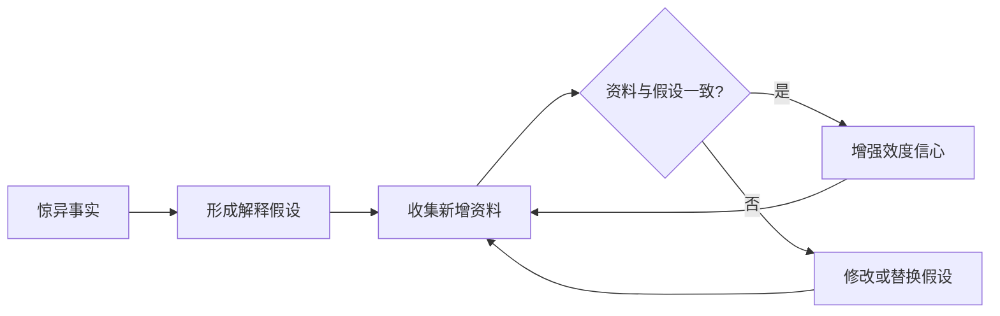
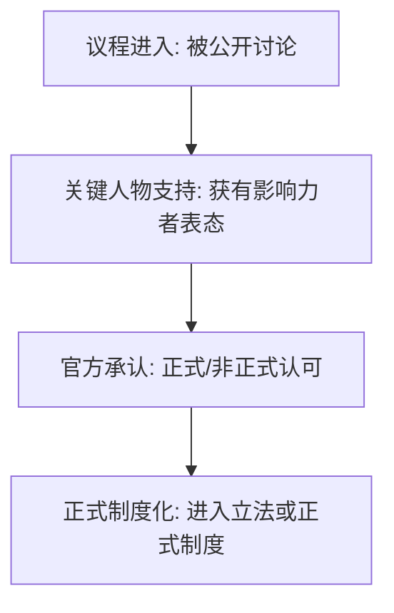

# 质性分析方法

> 覆盖质性研究全过程模型中的**归纳迭代分析**阶段。用于编码、主题生成、框架应用和内容分析。

---

## 0. 精益编码总则

所有质性分析方法共享一个核心编码逻辑：

```
通读资料库 → 备忘录（第一印象）→ 切分文本 → 贴短标签 →
缩减重叠标签 → 聚类 → 发展主题 → 关联主题 → 检验解释
```

**建议规模**：初始 30-50 个代码 → 缩减至约 20 个代码 → 聚类为 5-7 个主题。

**关键原则**：
- 代码不是分析结果——代码必须向主题/概念/理论推进
- 持续比较贯穿全程：事件比事件→概念比事件→概念比概念→范畴比范畴
- 备忘录是论文初稿的原材料——记录编码决策、理论直觉和文献对话

---

## 1. 扎根理论 (Grounded Theory)

### 1.1 三大学派

| 学派 | 代表学者 | 编码步骤 | 核心特征 |
|------|---------|---------|---------|
| 经典扎根 | Glaser & Strauss (1967) | 开放→选择→理论编码 | 不预设框架，让理论从数据中涌现 |
| 程序化扎根 | Strauss & Corbin (1990/1998) | 开放→主轴→选择编码 | 引入编码范式模型（条件-行动-结果） |
| 建构扎根 | Charmaz (2006/2014) | 初始→聚焦→理论编码 | 强调研究者与数据的共建，接受多元解释 |

### 1.2 编码范式模型 (Strauss & Corbin)

主轴编码围绕"编码范式"展开六个维度，将碎片化的开放编码整合为连贯结构：

```
因果条件 → 核心现象 → 脉络条件 → 中介条件 → 行动/互动策略 → 结果
```

编码范式在主轴编码阶段用于发现并阐明各编码范畴之间的相互联系，帮助研究者将分散的开放编码系统地串联成一个逻辑整体。

### 1.3 编码操作流程

1. **开放编码**：逐行阅读，用动名词短语标注（如"争取资源""回避问责"），保持贴近数据
2. **主轴编码**：用编码范式模型将开放编码组织成"范畴-子范畴"层级结构
3. **选择编码**：识别能统领多数范畴的核心范畴，撰写故事线将各范畴串联
4. **理论饱和**：继续收集数据直到新数据不再产生新的范畴属性

### 1.4 持续比较法 (Constant Comparison)

扎根理论的核心分析引擎，贯穿所有编码阶段：

- 事件与事件比较 → 生成概念
- 概念与事件比较 → 精炼概念属性
- 概念与概念比较 → 形成范畴
- 范畴与范畴比较 → 确立关系和理论边界

### 1.5 备忘录 (Memo-writing)

- 记录分析决策：为什么生成这个编码、为什么合并这些范畴
- 记录理论直觉和暂时性假设
- 记录与其他文献的对话（延迟文献回顾并非不看文献）
- 最终备忘录是论文初稿的核心原材料

---

## 2. 主题分析 (Thematic Analysis)

### 2.1 Braun & Clarke 六步法 (2006, 2021)

| 步骤 | 操作 | 产出 |
|------|------|------|
| 1. 熟悉数据 | 反复阅读、转写、做初步笔记 | 数据熟悉笔记 |
| 2. 生成初始编码 | 系统编码所有相关数据片段 | 初始编码列表（100-300 个） |
| 3. 寻找主题 | 将编码归类为候选主题 | 候选主题 + 子主题地图 |
| 4. 审查主题 | 检查主题内部连贯、主题之间区分清晰 | 主题地图 v2，合并/拆分/丢弃 |
| 5. 界定与命名 | 为每个主题写定义和边界 | 最终主题名称 + 定义段落 |
| 6. 撰写报告 | 用生动引文和分析叙述每个主题 | 论文主题分析章节 |

### 2.2 三种取向

| 取向 | 编码方式 | 理论关系 |
|------|---------|---------|
| 归纳 (Inductive) | 由数据驱动，不预设编码框架 | 与扎根理论接近但更灵活 |
| 演绎 (Deductive) | 由理论/研究问题驱动，预设编码模板 | 与框架分析接近 |
| 批判/潜伏 (Critical/Latent) | 分析话语背后的意识形态和权力结构 | 与话语分析接近 |

### 2.3 主题分析质量自检 (Braun & Clarke, 2006)

- 编码不是简单的数据摘要，而是分析性标签
- 主题不是"话题"(topic)，而是围绕某个核心意义/模式的解释
- 每个主题的内部一致性和主题间区分清晰
- 引文占分析文本比例不超过 30%，分析占 70%
- 是否有反例或例外案例被讨论？

---

## 3. 框架分析 (Framework Analysis)

> **命名注意**：本节"框架分析"指 Ritchie & Spencer (1994) 的政策研究五步框架法（Framework Analysis）。社会学传统中戈夫曼的 Frame Analysis（框架化分析/设框分析）是不同的方法论，见新增§ "框架化分析 (Frame Analysis / 设框分析)"。

### 3.1 适用场景

- 应用政策研究，需要在短期内生成可操作建议
- 多学科团队合作，需要透明系统的方法
- 有初步研究问题但数据收集前可以预设关键议题
- 多案例比较分析

### 3.2 五步法 (Ritchie & Spencer, 1994)

| 步骤 | 操作 |
|------|------|
| 1. 熟悉 | 通读数据，标记关键议题 |
| 2. 建立框架 | 根据研究问题+数据反复构建编码框架 |
| 3. 标引 | 将框架应用到全部数据（可使用 NVivo/MAXQDA/Atlas.ti） |
| 4. 制图 | 创建按主题×案例的矩阵，每个单元格放摘要 |
| 5. 映射与解释 | 在矩阵中寻找模式、关联和解释 |

### 3.3 框架矩阵示例

| 案例 | 主题1：政策理解 | 主题2：执行障碍 | 主题3：适应策略 |
|------|---------------|---------------|---------------|
| A校 | "认为减负就是少布置作业" | 家长投诉、教师惯性 | 增加课堂效率 |
| B校 | 将减负理解为课程整合 | 评价体系未同步 | 跨学科项目 |

---

## 4. 内容分析 (Content Analysis)

### 4.1 定量 vs 定性内容分析

| 维度 | 定量内容分析 | 定性内容分析 |
|------|-------------|-------------|
| 目标 | 系统量化文本特征 | 解释文本中的意义模式 |
| 编码 | 预定义编码本，独立编码 | 编码本可迭代演进 |
| 信度 | 必须报告 κ 或 α | 可选，不强制 |
| 分析 | 频次、交叉表、卡方检验 | 主题归纳、模式识别 |
| 代表 | Berelson (1952), Krippendorff (2018) | Schreier (2012), Hsieh & Shannon (2005) |

### 4.2 定性内容分析的三种路径 (Hsieh & Shannon, 2005)

| 路径 | 起点 | 编码来源 |
|------|------|---------|
| 常规 (Conventional) | 数据驱动，没有预设理论 | 从数据中归纳 |
| 定向 (Directed) | 已有理论/框架指导 | 理论演绎 + 数据补充 |
| 总结 (Summative) | 关键词识别→语境解释 | 先量化后质性 |

### 4.3 抽样要求

- 内容分析的核心抽样原则：**分析单位**必须明确（词/句/段/篇/人物/事件）
- 时间范围必须指定（如 2015-2025 年政府工作报告）
- 来源范围必须指定（如《人民日报》+ 31 省党报）
- 样本量论证：数据来源何时达到信息饱和

---

## 5. 编码本设计规范

### 5.1 编码本要素

每条编码必须包含：

1. **编码名称**：简短标签（最大化 4-5 词）
2. **清晰定义**：该编码捕捉什么现象
3. **纳入标准**：什么文本属于该编码（必要条件）
4. **排除标准**：什么文本不属于该编码（边界）
5. **典型例子**：至少 2 条，附原文摘录
6. **边界案例**：模棱两可的情况及处理规则
7. **与相近编码的区别**：如"焦虑"≠"恐惧"的区别
8. **修订记录**：日期 + 修订理由

### 5.2 编码本演进

- V1.0：基于前 20% 数据归纳生成，约 20-50 个编码
- V2.0：应用到 50% 数据后，合并/拆分/新增
- V3.0：终版编码本（人工复核后可锁定的版本）
- 编码本每一次演化需记录：哪些编码被合并、拆分、新增、删除，以及理由

---

## 6. LLM 辅助编码协议

### 6.1 适用场景

- 大规模文本（> 100 篇文档），人工编码不可行
- 初始编码生成（加速扎根理论的开放编码阶段）
- 探索性分析（确认值得深入人工分析的方向）

### 6.2 操作流程

1. **去标识化**：所有文本先人工去标识化（姓名/机构/地点/联系方式），不可将含个人身份的文本直接输入外部 LLM API
2. **编码本注入**：将编码本完整写入 prompt，包括定义、纳入/排除标准、典型例子
3. **LLM 初编码**：逐段请求编码，要求返回"编码 + 原文摘录 + 置信度"
4. **人工核验**：随机抽取 20-30% 的 LLM 编码结果，由人工独立编码做交叉验证
5. **分歧处理**：LLM 与人工不一致的区段，人工重编码并修订 prompt
6. **最终报告**：报告 LLM 编码-人工编码一致率，标注 LLM 辅助的局限性段落

### 6.3 风险与限制

- LLM 可能生成不存在的编码（幻觉）→ 必须有人工核对
- LLM 可能受训练数据偏见 → 敏感话题（种族、性别、宗教）应优先人工编码
- LLM 缺乏文化语境 → 特定文化/方言文本应人工编码
- 编码者间的信度评估不能替代 LLM-人工的一致性报告

---

## 7. 质性远读策略

> 前沿提案（王宁 2024）。尚未被广泛引用，标注为方法论前沿。

### 概念
质性远读（Qualitative Distant Reading）是借助思维抽象拉开与资料文本的心理距离、以更整体的视野"俯视"资料的策略。区别于莫莱蒂的量化远读（大样本、量化指标），质性远读处理小样本文本，强调心理距离（齐美尔）而非物理距离。

**与量化远读的区分**：

| 维度 | 量化远读 | 质性远读 |
|------|----------|----------|
| 资料样本 | 大样本、大数据 | 小样本 |
| 距离化方式 | 时间跨距、空间跨距 | 心理距离（抽象化/概括化） |
| 分析方法 | 量化分析、变量简化 | 质性分析、理论升华 |
| 近读远读关系 | 分化 | 交织（近距远读） |
| 哲学基础 | 实证主义 | 释义主义 |
| 目标 | 发现客观规律 | 展现社会学想象力 |

### 与传统质性方法的区别
质性远读与传统方法的关键区别在于最高层次抽象的**时间性和功能性**：
- 传统方法：最高抽象是研究后期**结论性**的产物
- 质性远读：最高抽象是研究早期**假设性**的产物（需内部证伪和修改）

### 三大操作策略

**策略一：及早提高解释的抽象层级**
基于利伯曼&措普的心理距离解释层次理论（CLT）——抽象解释增加心理距离。对近距离资料使用高抽象概念解释，实现"近距远读"。操作：尽早形成类属概念（归类）并建立概念之间的连接（外部连接）。

**策略二：及早采用理论溯因推理**
在资料收集早期就对有限资料进行溯因（形成解释性假设），尽早获得整体性理论视野。溯因推理的结论带有猜测性，需随后续新增资料不断修正（见 §8）。

**策略三：借助备忘录撰写**
备忘录撰写是编码方法的必要补充。编码侧重严谨实证性，备忘录侧重拔高思维抽象程度——捕捉转瞬即逝的思维火花，积少成多。

### 边界条件
- 适用于小样本质性研究（访谈、民族志、文本分析）
- 需要研究者具备较强的理论抽象能力
- 需在早期阶段就着手理论建构
- 不适用于量化远读的大数据场景

### 参考
- 王宁 (2024). 质性资料分析中的质性远读策略.《广东社会科学》
- Simmel, G. (1903). The Metropolis and Mental Life.
- Moretti, F. (2000). Conjectures on World Literature.
- Liberman & Trope (1998). The Role of Feasibility and Desirability...

---

## 8. 溯因推理操作化

### 概念
溯因推理（Abduction）是皮尔士提出的第三种推理形式，指从观察到的惊异事实推论出最佳解释性假设的过程。在三种推理中溯因的知识创新功能最强、结论确定性最低（猜测性）。

| 推理类型 | 逻辑方向 | 确定性 | 创新功能 |
|----------|---------|--------|---------|
| 演绎 | 一般→特殊 | 最高 | 低 |
| 归纳 | 特殊→一般 | 中等 | 中等 |
| 溯因 | 结果→原因 | 最低（猜测性） | 最高 |

### 操作步骤
1. **发现惊异事实**：识别现有理论无法充分解释的现象（"惊异"是相对于学术共同体已有理论库存而言的）
2. **形成解释性假设**：提出可能的原因解释（创造性溯因）
3. **选择最佳解释**：从多个候选假设中评估选择（选择性溯因/最佳解释溯因）
4. **内部证伪**：用新增资料检验和修正假设，进入溯因研究循环

### 溯因研究循环



### 三种理论创新路径（Kelle 2005 分类）
1. **形式理论指导**：用一般/形式理论做指导，建立扎根的中层实质理论
2. **挑战现有理论**：用质性资料挑战现有理论并提出替代解释
3. **跨领域理论转移**：将A领域的理论迁移应用至B领域

### 常见失败
- 过早结束研究未穷尽反例（分析性归纳的陷阱）
- 将溯因结论当作确定性结论
- 假设修改过于频繁无法形成稳定框架
- 缺乏学术共同体意识——将个人常识性惊异当作学科意义的惊异

### 质量门槛
- 惊异事实必须相对于学科共同体已有理论库存
- 解释性假设必须可被经验资料检验和证伪
- 溯因循环至少经过2-3轮资料收集和假设修正

### 参考
- Peirce, C.S. Collected Papers.
- Reichertz, J. (2007). Abduction: The Logic of Discovery of Grounded Theory.
- Tavory, I. & Timmermans, S. (2014). Abductive Analysis.
- Kelle, U. (2005). "Emergence" vs. "Forcing" of Empirical Data?

---

## 9. 框架化分析 (Frame Analysis / 设框分析)

> **区分**：本条为戈夫曼社会学传统的 Frame Analysis (Goffman 1974; Benford & Snow 2000)，关注社会行动者的设框过程及其意义建构后果。与 §3 "框架分析 (Framework Analysis, Ritchie & Spencer 1994)" 是不同方法论传统——后者是政策研究的五步数据管理框架。

### 概念
框架化分析是戈夫曼提出的分析日常生活中的设框（framing）如何建构社会现实的方法。框架是"解释图式"——个人通过它组织经验、赋予意义。设框（framing）则是利用框架工具达成意义建构和社会动员目的的行动。

### 核心设框任务三要素（Snow & Benford）
1. **诊断性设框**：界定问题、归因责任
2. **处方性设框**：提出解决方案
3. **鼓动性设框**：发出行动召唤

### 框架校准四策略
1. **框架桥接**：连接两个意识形态一致但未连接的框架
2. **框架放大**：将现有价值/信仰理想化以提升激励
3. **框架扩展**：将动员对象的利益和关注整合进框架
4. **框架转换**：用新框架替换旧框架

### 设框的四种类型（按社会影响范围）
| 类型 | 作用范围 | 示例 |
|------|---------|------|
| 互动型 | 小范围社会互动 | 客人打碎杯子，主人说"碎碎平安" |
| 动员型 | 社会运动参与者 | 社会运动组织的框架动员 |
| 治理型 | 公司/国家/国际组织 | 政策合法性论证 |
| 统治型 | 统治范围内的思维模式 | 意识形态话语生产 |

### 框架制度化四梯级（Bennehag & Erikson）



### 宏观行动者与微观-宏观勾连
框架分析的独特贡献：通过区分微观/中观/宏观行动者（莫泽里斯），揭示微观设框过程如何产生宏观社会后果。设框者的权力层级越高，社会影响范围越广。

### 框架共鸣 vs 框架效果
- **框架共鸣**（有效性）：设框是否触动了目标观众（取决于可信度+显著性）
- **框架效果**：除目标观众共鸣外，还包含敌对行动者的反弹和抵制等非预料后果

### 常见失败
- 将框架分析降格为话语内容描述（应侧重设框**过程**）
- 忽略非预料后果
- 框架命名随意（诊断/处方/鼓动必须有操作化对应）
- 将框架共鸣等同于框架效果

### 质量门槛
- 必须区分分析者框架和研究对象框架
- 框架校准过程必须有经验证据支持
- 制度化分析覆盖至少两个梯级的变化
- 框架效果分析必须包括非目标观众的负面反应

### 参考
- Goffman, E. (1974). Frame Analysis.
- Snow, D.A. & Benford, R.D. (1988). Ideology, Frame Resonance, and Participant Mobilization.
- Benford, R.D. & Snow, D.A. (2000). Framing Processes and Social Movements.
- Entman, R.M. (1993). Framing: Toward Clarification of a Fractured Paradigm.
- 王宁 (2025). 语言使用与框架设置——框架分析的本体论基础与方法论意义.
