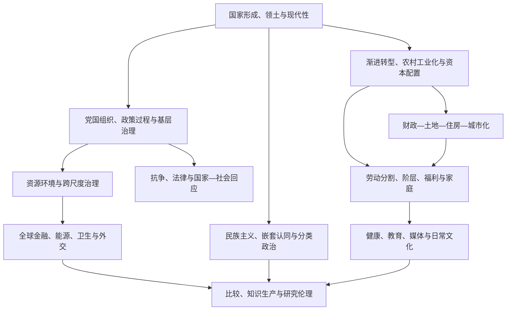

# 当代中国研究理论框架：以知识点族重组《The SAGE Handbook of Contemporary China》

> **材料基础**：Weiping Wu、Mark V. Frazier 主编《The SAGE Handbook of Contemporary China》中文译文（本地 translation.md）。
>
> **编排方法**：本框架从原书的章节论证、章节内机制和各章参考文献抽取理论卡，而非以通用理论清单覆盖原书。每张卡按社会学框架的方式写出核心主张、机制链条、原书证据、竞争解释、研究设计与关键文献。
>
> **使用边界**：原书主要反映其写作期的学术争论与经验材料；它支持机制建构和问题定位，不能直接替代对新时段、新地区和新群体的实证核验。

## 全书机制地图

- 原书反复提示：同一结果必须放进国家、地方、组织、家庭和跨境关系的联结中解释。
- 箭头表示需要以时间顺序和中间证据识别的传导路径，不是预设的单向因果。
- “中国情境”在这里指可观察的制度、组织、空间和历史条件，而不是用特殊性终止解释。

## 一、国家形成、现代性与领土化政治

### 1.1 现代国家再造：合法性、强制与组织能力 — Weber; Tilly; Jessop

- **核心主张**：原书把现代中国理解为持续中的国家再造，而非已完成的国家形态。韦伯的合法强制定义用来识别政治组织；Tilly 的国家形成问题提示外部竞争与资源汲取；Jessop 的战略—关系路径要求将国家能力拆为可变的组织和社会关系。
- **机制链条**：外部竞争与内部危机 → 领土、财政、军事/组织和信息能力重组 → 政治共同体与共同利益叙事 → 国家对社会的实际穿透和地方协商 → 合法性资源积累、耗损或修复。
- **原书证据**：晚清“廉价治理”、县官与士绅/宗族/行会协商、民国国家建设受挫、共产党取得组织与强制资源、改革后以发展和民族复兴重建信任，构成一条连续而有转折的机制链。
- **研究设计**：分别追踪人事、财政、信息、县以下控制、公共品、危机处置和对象经验；不能以行政级别、税收或执法数量任一指标代理全部能力。
- **竞争/边界**：地方精英网络、经济增长、国际环境与领导策略都可能解释国家结果。必须比较不同层级、部门和政策领域，不能预设“中央强/地方弱”。
- **关键文献**：Weber（1947）；Tilly（1992）；Jessop（2016）；Abrams（1988）；Silberman（1993）；Rowe（2010）；Duara（1988）。

### 1.2 帝国遗产、民族形式与领土性 — Duara; Rawski; Xu

- **核心主张**：民族国家并非把帝国遗产一笔抹除。清帝国多民族治理、天下观念、明确边界、汉人认同和现代主权秩序在原书中被呈现为互相叠加的历史过程。
- **机制链条**：帝国治理与多重统治身份 → 外来竞争、领土危机和主权语言 → 地图、教育、行政分类和历史叙事 → 共同体想象与政治成员资格 → 当代领土/民族国家合法性。
- **原书证据**：从清帝国的多重统治称号到晚清改革、民国民族国家和人民共和国的民族形式，原书强调“延续性”与“中介性时间性”，反对传统/现代二分。
- **研究设计**：把边界政策、地图、教材、仪式、行政区划、族群分类和地方记忆连成一条证据链，区分国家叙事、精英方案和日常认同。
- **竞争/边界**：既不能文化本质化，也不能只以地缘竞争解释领土政治；需表明何种组织和实践使历史叙事进入当前行动。
- **关键文献**：Duara（1996, 2011）；Rawski（1998）；Xu（2015）；Rowe（2009）；Yao（2015）；Fairbank & Teng（1941）。

### 1.3 意识形态：组织路线、公共语言与合法化资源

- **核心主张**：原书把意识形态置于生产者、载体、政策语言和组织实践中，而非把它当作不可观察的“灌输”。它能规定政治路线和公共表达，也会经由发展、民族主义、学校、媒体与日常策略被再诠释。
- **机制链条**：党组织/宣传教育机构 → 术语、规范和价值叙事 → 干部、学校、媒体与社会组织转译 → 服从、策略性使用、沉默或认同 → 合法性和政策执行反馈。
- **研究设计**：比较文件、干部学习、媒体内容、课堂材料、政策解释和对象叙述之间的相符/偏离；口号出现频率不等于实际信念。
- **竞争/边界**：顺从可由物质激励、组织依附、风险规避或真正认同导致；须以中间过程区分，不能只从结果反推意识形态作用。
- **关键文献**：原书“中国共产党与意识形态”章关于生产者与载体、混沌理论和新时代变化的书目；Fewsmith & Rosen（2001）。

## 二、渐进转型、农村发展与国家主导政治经济

### 2.1 双轨改革与“走出计划”的渐进机制 — Naughton; Nolan; Jefferson & Rawski

- **核心主张**：原书反对“计划突然被市场替代”的线性故事。农村试验、计划/市场双轨、经营责任制、国企利润激励、缓慢私有化和有限开放，使增长、稳定和制度残余并存。
- **机制链条**：保留计划配额与组织保障 → 在增量产出引入市场价格/利润激励 → 地方试点和制度学习 → 公司、合同、金融与产权规则配套 → 市场扩展与保护性制度并存。
- **原书证据**：家庭承包先行，城市经营责任制后推；双轨制在激励生产的同时保留行政轨道。原书将渐进主义与避免大规模失业相联系，也指出其造成市场分割和保护主义。
- **研究设计**：把改革拆为价格、产权、利润留成、合同、企业进入、融资、劳动流动和福利；记录试点先后、政策适用范围及地方执行。
- **竞争/边界**：增长亦可能来自劳动力再配置、外需、基建或技术扩散。改革年份或“市场化指数”不是机制本身，渐进主义也不应被写成普遍成功律。
- **关键文献**：Naughton（1995）；Nolan（1995）；Jefferson & Rawski（2002）；Jefferson & Su（2006）；Groves et al.（1995）；Yueh（2011）。

### 2.2 农村改革、土地权利与乡镇企业的次优性 — Whiting; Oi; Qian; Rodrik

- **核心主张**：家庭联产承包、集体土地、乡镇企业与地方干预说明，制度效能不能只按是否私有化判断。原书以“过渡性”“次优制度”概括乡镇企业在产权保护不足、市场未完备时的作用，同时保留其成功来源的争论。
- **机制链条**：承包激励与农业剩余 → 劳动力/资本释放 → 乡镇村集体与私人企业发展 → 地方税收和预算外资源 → 公共品与基层激励 → 财税、金融和产权改革改变其优势。
- **原书证据**：集体企业更易获信贷、创造地方收入和公共品；另一派解释强调小规模私人投资。1994 年分税制、银行改革和私产保护强化后，乡镇企业的过渡优势下降。
- **研究设计**：分开测量土地合同稳定性、实际经营权、村/乡企业所有制、信贷、地方收入、公共品和就业；不能把“集体/私营”视为单一因果变量。
- **竞争/边界**：市场接近性、灌溉、工业遗产、劳动力和干部策略均会改变结果。集体产权不等于公平，私人产权也不保证融资或公共品。
- **关键文献**：Whiting（2001, 2004）；Oi（1992, 1999）；Qian（2003）；Rodrik（2008）；Huang（2008）；Wong（1997）；Li & Rozelle（2000）。

### 2.3 粮食安全、补贴与资源约束的政策悖论

- **核心主张**：原书将粮食安全放在个人获得食物、国家自给目标、财政成本和水土资源之间分析。最低收购价、临时收储、关税和农业 ODI 可稳定供给和收入，也会形成库存、价差、投机进口及环境压力。
- **机制链条**：自给目标 → 价格支持/补贴/关税 → 农户作物选择和储备累积 → 财政成本、进口价差和资源消耗 → 目标价格改革 → 收入、环境与安全的新权衡。
- **研究设计**：同时记录收购价、市场价、补贴取得、经营面积、库存、进口、水土投入和农户收入；产量单项不足以判断政策福利。
- **竞争/边界**：粮食自给不自动等于粮食安全，关键是获得能力。政策效果受经营规模、村级发放、国际价格和水资源差异调节。
- **关键文献**：Sen（1981）；Tao et al.（2004, 2010）；Lin & Ho（2005）；Huang et al.（2015）；Dalin et al.（2015）；Gooch & Gale（2015）。

### 2.4 国企、金融、FDI 与创新的条件性组合

- **核心主张**：原书未将国企、金融、外资和创新写作独立主题：国企同时承担就业、公共品、产业安全与盈利任务；金融扩张不等于高效配置；FDI 的技术效果依赖吸收能力、知识产权与国家科技计划；专利数量不等于基础创新。
- **机制链条**：企业使命与治理/融资规则 + 开放政策 → 信贷、补贴、竞争、外资及供应链联系 → 企业学习/重组或预算软化 → 技术、就业、风险和增长结果 → 监管与改革。
- **研究设计**：分列企业所有权、章程使命、行业监管、实际融资、外资类型、研发、专利质量、就业、偿债和退出；将政策承诺、实际取得、使用和绩效区分。
- **竞争/边界**：行业周期、技术机会、地区优势和企业自选择进入政策均可能解释差异。国企不必然低效，民企也不必然脱离政策网络。
- **关键文献**：Gallagher（2005）；Harvey（2005）；Hung（2009）；原书“国有企业”“金融体系”“FDI”“技术、创新与知识经济”四章书目。

## 三、资源、环境与跨尺度可持续性

### 3.1 区域地理、环境转型与风险分配

- **核心主张**：原书将土地、气候、水、地形、资源、土地利用和区域产业化视作增长的限制条件和风险分配机制。地理不是静态控制变量，改革后的水、空气和土地变化会以不均等方式进入健康、迁移和地方经济。
- **机制链条**：区域自然条件/资源 → 工业化和城市化需求 → 污染、水土压力与健康暴露 → 地方监管、信息与环境意识 → 产业、人口和政策反馈。
- **原书证据**：东北、东南、西南与西北呈现不同资源组合；原书特别用水事官僚碎片化说明环境结果不能被中央政策文本直接解释。
- **研究设计**：将环境指标与产业、人口、财政、执法、健康和社区经验按区域—城市—社区尺度联结，并检验时间滞后与跨区转移。
- **竞争/边界**：总排放下降不等于地方风险下降；监测能力、气候和产业外迁都可能改变可观察结果。不能以单项指标代理可持续性。
- **关键文献**：Mertha（2014）；Wang & Hao（2012）；Zhang et al.（2012）；Cao（2008）。

### 3.2 能源安全、全球供应与清洁转型

- **核心主张**：能源、矿产、粮食、林业和水资源在原书中共同构成“维持增长”的多目标问题。能源安全至少包括供应、需求/能效、海外获取、清洁能源、行业治理与国际规则，不能压缩为资源进口。
- **机制链条**：增长与资源需求 → 国内能源结构和能效政策 + 海外供应策略 → 企业、金融和外交资源配置 → 环境/社会成本 → 国际规则和国内政策反馈。
- **研究设计**：分别测量进口、海外投资、国内能源结构、能效、污染、就业、价格、地方收入和治理，不将安全、清洁与可负担性混成一个变量。
- **竞争/边界**：海外资源布局可由商业、供应、产能、金融与外交多重动机驱动；绿色转型同样可能重分配风险。
- **关键文献**：原书“维持增长：能源与自然资源”“中国与全球能源治理”章的自力更生、走出去、清洁能源、反腐与全球领导讨论。

## 四、党国组织、政策过程、基层治理与腐败

### 4.1 行政级别、条块关系与碎片化协调 — Lieberthal; Oksenberg; Lampton

- **核心主张**：原书的政策过程不是“中央命令—地方服从”。行政级别、条上集中领导、块上分散领导、业务关系、领导关系、系统和领导小组共同决定谁能命令、谁需协商及政策如何被转译。
- **机制链条**：政治优先事项 → 行政级别与文件效力 → 条/块领导关系 → 空间和职能协调 → 领导小组/系统整合 → 地方适配、执行偏差或新制度安排。
- **原书证据**：同级单位不能相互下达约束性命令，因此有谈判激励；地方知识带来适配，也引入执行偏差；量化指标更容易被考核，形成不同政策领域的执行差异。
- **研究设计**：把隶属、级别、文件类别、预算、人事权、协调小组、指标、上报与地方配套文本放在同一链条中，不能只读中央文件。
- **竞争/边界**：差异也可来自财政、对象需求、行业技术和试点选择。碎片化不等于失灵，协调机制可能改变其后果。
- **关键文献**：Lieberthal & Oksenberg；Lampton（1987, 1992）；Landry；Mertha；Miller；周望。

### 4.2 党政关系、人事控制与领导小组

- **核心主张**：职务名单制、交叉任职、党组及党主导领导小组，是原书解释党如何影响政府政策的中层机制。它们提供纵向控制，也重排部门协调、责任归属和专业空间。
- **机制链条**：组织部门任命/党职级别 → 党政交叉任职与党组 → 政策归口、领导小组及考核 → 部门与地方行为 → 问责、调整与组织再生产。
- **原书证据**：原书指出党组织遍布学校、医院、工厂等组织；政府领域也可被党主导领导小组重新纳入协调，故不能用“政府部门”代替实际决策单位。
- **研究设计**：追踪任命、党政职务重叠、领导小组构成、会议、政策归口和问责，而不从组织名称直接推断控制力。
- **竞争/边界**：党组织不消除专业部门、地方政府或市场主体的行动空间；实际作用必须在具体政策领域验证。
- **关键文献**：Barnett；Lieberthal；Burns；Alford；原书“官僚体制与政策制定”章书目。

### 4.3 运动式治理与反腐的短期集中—长期制度张力

- **核心主张**：原书区分群众动员型、整党/强党型和地方问题解决型运动。集中动员可在常规协调困难时汇聚资源，却可能诱发短期化、选择性执行和数据策略；反腐亦需要区分案件、测量、原因和制度后果。
- **机制链条**：问题政治化 → 督查、动员、惩戒与资源集中 → 干部/基层组织调整 → 可见成绩、替代行为或信息修饰 → 常规制度吸收、回弹或下一轮运动。
- **研究设计**：以长时段比较运动前后任务、资金、处罚、服务、投诉、媒体曝光和正式规则，不能把查处数量或检查次数当作真实问题规模。
- **竞争/边界**：短期指标改善可来自重点检查或测量改变；腐败案件增加也可由侦查增强导致。运动与常规治理、纪律与法律应分别测量。
- **关键文献**：原书“改革时期的腐败”“政治中的运动”两章关于多方法测量、政治/经济/法律/文化解释和地方案例的书目。

### 4.4 基层双重治理、双重问责与参与创新

- **核心主张**：村党支部与村委会、居委会与业委会的关系显示，基层不是国家/社会二元对立的末端。上级任命和社区回应造成双重权威、资源冲突、协商与制度创新并存。
- **机制链条**：选任方式和资源控制 → 向上考核/向下回应的不同激励 → 土地、企业、财务与公共品决策 → 冲突、合并职务或协商 → 社区代表性和服务结果。
- **原书证据**：“一肩挑”可减少党支部书记与村主任冲突而强化党影响；但基层领导仍是社区成员，无法完全忽略本地需求。市场化改变资源控制，却保留土地、调解和政策执行职能。
- **研究设计**：记录选任、党政是否合一、村账、集体收益、公共品、村民会议、参与式预算、业委会和投诉结果，区分形式设置与实际决策权。
- **竞争/边界**：选举不等于有效问责，党组织也不等于地方需求消失。资源基础、财务规则和人员网络必须进入解释。
- **关键文献**：Oi & Rozelle（2000）；Guo & Bernstein（2004）；Zhao（2007）；Su & Yang（2005）；Read（2003）；Alpermann（2001, 2009）。

## 五、劳动制度、国家—社会关系、抗争与法律

### 5.1 从单位保障到劳动市场分割 — Walder; Lee; Chan; Selden

- **核心主张**：原书以单位制解体、国企重组、农民工无产阶级化、劳务派遣和服务业扩张解释劳动政治。劳动保障是国家—社会关系的组成部分，不是增长之外的社会政策残余。
- **机制链条**：单位福利/组织依附退出 → 市场化、外包与派遣 → 正式工、下岗工、农民工和服务业劳动者的风险差异 → 个体/集体维权 → 劳动法、仲裁与政府回应。
- **原书证据**：派遣工在国企与合资企业中均可能占较高比重且待遇较低；劳动合同法试图限制非正规化，但法律权利与实际受理/执行不可混同。
- **研究设计**：联结合同、派遣/外包、工资、福利、工时、行业、户籍、仲裁与集体行动；仅以职业类别或平均工资无法把握分割。
- **竞争/边界**：技能、行业和城市会解释部分差异；但控制它们后仍应检验合同、户籍和组织位置。不能将所有农民工视为同质。
- **关键文献**：Walder（1986）；Lee（2007）；Chan（2009）；Gallagher（2017）；Zhou（2013）；Zhang（2015）；Pringle（2017）；Chan & Selden（2014）。

### 5.2 抗争剧目、合法性框架与回应分化

- **核心主张**：国企工人、农民工、农民抗税、反征地、中产和环境抗议在原书中具有不同的组织、空间、领导、诉求和回应结构。权益受损不是集体行动的充分条件。
- **机制链条**：风险/损失 → 共同解释与诉求框架 → 网络、领导和细胞式组织 → 信访、诉讼、协商、停工或抗议 → 吸纳、救济、压制或制度调整。
- **原书证据**：Lee 区分国企工人的恢复性“波兰尼式”抗争和农民工较主动的“马克思式”动员，同时警告不可把部门与地区、年龄、性别混同。
- **研究设计**：将事件数量、参与者、组织化、诉求、法律语言、行动场所、媒体可见性和回应结果分开编码，并用过程追踪而非发生/未发生二分。
- **伦理/边界**：事件数据受审查、报道与组织风险影响；不得从可见抗议数量推断总体不满，敏感材料应最小化可识别信息。
- **关键文献**：Lee（2007）；原书“民众抗议”“劳工政治”两章关于抗争模式、领导/动员及国家回应的书目。

### 5.3 法律发展、司法体系与实际救济

- **核心主张**：原书区分法律制度建设、法学与立法参与者、司法机构、法律实施和“法治/fazhi”争论。存在法律文本不等于权利可被主张、受理、执行或公平实现。
- **机制链条**：法律制定/制度建设 → 行政、司法与专业组织解释 → 当事人的信息、证据、成本与风险 → 受理、调解、仲裁、审判或信访 → 实际救济和权利意识变化。
- **研究设计**：逐项记录知道权利、提出主张、是否受理、处理时间、救济形式、执行和后续关系；将文书、经办记录与当事人叙述交叉验证。
- **竞争/边界**：案件增多可代表侵害增加或可及性提高；公开文书与正式统计会遗漏未进入正式渠道者，国际规则借鉴也不代表同质执行。
- **关键文献**：原书“法律与司法体系”章有关新法律体系、司法机构、最高人民法院、法治争论和实施挑战的书目。

## 六、全球嵌入、全球治理与对外政策的国内基础

### 6.1 全球金融、政策性银行与海外投资

- **核心主张**：储备积累、汇率、主权财富基金、政策性银行、企业 ODI、人民币国际化和基础设施外交在原书中是不同机制，连接国内资本配置、企业战略、国际金融和外交政策。
- **机制链条**：外贸/储备与汇率结构 → 政策性金融和投资工具 → 企业海外项目 → 国内产业、风险与外交目标 → 接受国、市场和规则反馈。
- **研究设计**：分列储备、贷款、股权、项目、企业类型、行业、风险分担、接受国政策与国内回流；承诺、签约、落地和绩效不可互代。
- **竞争/边界**：海外项目可由利润、资源、产能、金融与外交多重动机驱动。接受国政治、全球周期和企业能力会改变政策工具结果。
- **关键文献**：原书“作为全球金融大国的中国”章关于政策性银行、人民币国际化和基础设施外交的书目。

### 6.2 全球机制与全球卫生：加入、遵守、危机与反馈

- **核心主张**：原书反对用“融入/挑战秩序”二分中国。贸易、金融、军控、人权、维和、卫生援助、SARS 遗产、FCTC 与 IHR 各有不同规则、国内组织和利益结构。
- **机制链条**：国际机制/卫生危机 → 国内部门、法律、报告和公共卫生调整 → 加入、遵守、保留或议程塑造 → 援助、信誉与国内政策反馈。
- **研究设计**：以成员资格、国内转化、执行、谈判立场、资源投入和受援/卫生结果的全链测量，不能仅以投票或援助金额判断作用。
- **竞争/边界**：合作/冲突在不同机制中可以并存；援助有外交、商业、专业和人道动机，危机中的合作未必延续到日常治理。
- **关键文献**：原书“中国与全球机制”“参与全球卫生治理机制”章关于加入/遵守、SARS、FCTC、IHR、双边与多边卫生合作的书目。

### 6.3 双边和区域关系的议题分化

- **核心主张**：中美、中日、中俄、朝鲜半岛和东南亚关系在安全、贸易、历史、台湾、能源、离散社群与区域制度上机制不同；竞争、合作与历史记忆可以在同一双边关系中并存。
- **机制链条**：外部结构和历史遗产 → 国内政策辩论、部门/企业利益、公众民族主义 → 议题立场与互动 → 对方/第三方回应 → 区域秩序与国内叙事反馈。
- **研究设计**：按安全、贸易、投资、能源、卫生、技术、人员流动与历史叙事编码，并将外交文本与国内组织/产业材料配对。
- **竞争/边界**：权力、民族主义或相互依赖任一项均不能解释所有变化；第三方冲击和全球市场可能是关键替代机制。
- **关键文献**：原书中美、中日、中俄、朝鲜半岛与东南亚章节有关外交史、历史问题、能源合作和南海的书目。

## 七、民族主义、嵌套认同、离散社群与分类政治

### 7.1 大众民族主义：现代化解释与帝国连续性的争论 — Anderson; Gellner; Duara

- **核心主张**：原书同时保留民族主义的现代主义解释（媒介、现代化、民族国家竞争）和 Duara 的连续性修正（帝国遗产与历史叙事）。大众民族主义又与后 1989 爱国主义合法化、国际争端和网络表达相连。
- **机制链条**：历史记忆、现代化与外部竞争 → 国家/媒体/教育叙事 → 民族自豪感和他者界定 → 网络/街头表达与政策压力 → 合法性和外交姿态。
- **研究设计**：区分调查自豪感、官方文本、媒体框架、平台表达、街头行动和政府政策；其中任何一项都不能替代其他项。
- **竞争/边界**：不能在“政府操控”与“自发大众情绪”之间二选一；线上高声量并不代表全体公众。
- **关键文献**：Anderson（1983）；Gellner（1983）；Duara（1996）；Fitzgerald（1996）；Pye（1996）；Zhao（2004）；Tang & Darr（2012）。

### 7.2 台湾、香港与多层国家认同

- **核心主张**：原书将台湾和香港认同置于法律地位、殖民/战后历史、政治改革、民主运动、主权转换与中国民族主义之间，反对以单一文化差异或制度差异解释地方认同。
- **机制链条**：历史制度与法律地位 → 政治参与、社会运动和精英协商 → 国家/地方/公民身份叙事 → 事件中的边界强化或协商 → 跨境关系反馈。
- **研究设计**：联结法律、媒体/教育、社会运动、代际叙述、组织资料和跨境经济；区分身份自认、政治偏好和具体政策立场。
- **竞争/边界**：殖民遗产、经济分化、民主制度和国家民族主义都是竞争解释；一时民调或事件不能写成固定认同。
- **关键文献**：原书“台湾认同”“香港认同”章关于法律层面、殖民后期改革、基本法、民主运动与本土主义的书目。

### 7.3 海外华人、华语语系与跨国网络

- **核心主张**：原书警惕把境外华人作为同质政治共同体。离散社群在移民史、语言、地方文化、商业网络和与中国国家关系上差异巨大；华语语系概念揭示中文文化生产的多样性及其与大陆资本/媒体的张力。
- **机制链条**：迁移/殖民历史 → 地方组织、语言和媒体 → 商业、思想、文化流动 → 中国国家、平台与资本联系 → 多样化、同质化或身份协商。
- **研究设计**：按出生地、代际、语言、组织、行业、媒体来源、资本与文化实践分层，不能用“华人”一类变量推断政治行为。
- **竞争/边界**：跨境联系不等于忠诚、影响力或国家代理；强本地机构可使大陆媒体/资本影响有限。
- **关键文献**：Shih（2007）；Sun & Sinclair（2015）；Li（1999）；Kuhn（2008）；Tagliacozzo & Chang（2011）。

### 7.4 族群、宗教与自我认定—外部归类的协商 — Barth; Brubaker; Varshney

- **核心主张**：原书呈现原生论、工具论和建构论的分歧，并强调自我认定与外部归类的持续协商。西藏、维吾尔、其他民族与宗教研究不能将行政类别、文化符号和政治动员视为同一对象。
- **机制链条**：国家分类、资源与安全政策 → 语言/宗教/教育和地方实践 → 自我认定与外部归类 → 边界强化、淡化或重构 → 不平等与治理后果。
- **研究设计**：分别记录行政身份、组织归属、语言/宗教实践、教育、资源分配、话语和行动；生命史、匿名化文本与政策材料可互证。
- **伦理/边界**：沉默和缺少公开表达不等于无经验；敏感研究须避免可识别化、分类伤害和从少量材料总体化。
- **关键文献**：Barth（1969）；Brubaker（2004）；Varshney（2009）；Anderson（1991）；Hobsbawm & Ranger（1983）；Duara（1991, 2004）；Ownby（2008a）。

### 7.5 性少数的承认、知识生产与社会行动

- **核心主张**：原书将性少数置于承认、研究史、全球多元化、影像和社会行动之间，不把它压缩为法律空白、卫生风险或固定身份。
- **机制链条**：国家/医学/家庭话语 → 污名或承认 → 学术分类、媒体表征和社群组织 → 服务、权利与表达 → 社会规范和实践变化。
- **研究设计**：区分法律、医学/教育话语、家庭经验、社群支持、媒体与行动；网络可见性不能代替社会承认。
- **伦理/边界**：性/性别资料有高识别风险，必须最小化收集，不能将疾病或困扰病理化为群体本质。
- **关键文献**：Evans（1997, 2000）；Wong（2005）；Kam（2013）；Engebretsen（2014）。

## 八、城市化、土地金融、住房与社会—空间转型

### 8.1 城市体系、全球—地方城市化与尺度

- **核心主张**：原书区分工业化主导、市场主导和全球—地方主导的城市化，并指出城市定义和度量会改变结论。城市体系与大都市连绵区使城市不能作为封闭行政单位处理。
- **机制链条**：工业/人口政策与市场改革 → 城市等级和区域分工 → 全球资本/产业连接 → 都市圈、通勤和服务网络 → 城市规模、空间结构与不平等。
- **研究设计**：明确常住人口、户籍人口、行政区、建成区和都市圈的口径；把产业、通勤、基础设施、住房和迁移流向一起分析。
- **竞争/边界**：人口增长、行政扩张和经济集聚可能不同步；市级平均值会掩盖社区层面的隔离和资格差异。
- **关键文献**：原书“城市化与城市体系”章关于度量、历史阶段、全球—地方主导城市化及 MIRs 的书目。

### 8.2 财政分权、土地融资与地方政府融资平台

- **核心主张**：原书将基础设施融资放在中央—地方收支不匹配、土地融资、杠杆和 LGFV 中。土地收益既是公共投资资源，也是债务、房地产和空间不平等的传导环节。
- **机制链条**：收支责任与融资约束 → 土地出让/抵押及项目选择 → 基建、开发和房产收益 → 债务、房价、服务与风险分配 → 再融资或财政改革。
- **原书证据**：地方政府借助土地与融资平台绕开举债限制，故建设规模不等于财政健康或服务公平。
- **研究设计**：分别记录预算、专项资金、土地出让、LGFV 负债、项目生命周期、维护、拆迁补偿和服务结果。
- **竞争/边界**：区位、人口、试点和地产周期会共同影响融资/建设；不能由房价或投资量单独认定土地财政。
- **关键文献**：Tao et al.（2010）；Lin & Ho（2005）；Chen & Kung（2016）；World Bank（2014）。

### 8.3 土地产权、住房市场与居住分异

- **核心主张**：土地所有权、土地市场规范、住房金融、房地产泡沫与社会—空间转型共同改变了资产、居住、地方政府、单位和家庭的关系。
- **机制链条**：土地权属/市场规则 → 规划、开发与金融 → 住房价格和取得资格 → 居住选择、迁移和公共服务 → 隔离、财富与机会再生产。
- **原书证据**：意识形态转变、户口、FDI、土地住房市场以及自上而下/自下而上城市化共同塑造社会空间；单位退出住房供给后仍可能作为市场主体存在。
- **研究设计**：联结土地交易、产权、开发融资、房价/租金、单位住房遗产、住房形态、学校医疗与社区人口；不能只做房价模型。
- **竞争/边界**：宏观信贷、人口和区位可解释房价；居住隔离既可由支付能力，也可由户籍、福利与拆迁共同造成。
- **关键文献**：Li（2005）；Harvey（2005）；原书“土地与住房市场”“城市的社会—空间转型”章书目。

## 九、户籍、迁移、农民工与城乡公民资格

### 9.1 户籍、跨地性与迁移家庭

- **核心主张**：原书将户籍放在就业、教育、住房、医疗、福利和家庭拆分的连接中。迁移可提高工资却不产生完整城市资格，农村土地与家庭仍是风险后盾。
- **机制链条**：户籍/居住资格与公共服务规则 → 城市就业、住房、教育和医疗 → 家庭拆分、留守照护、汇款与回流 → 代际机会和城乡再生产。
- **原书证据**：改革后的放松并未消除流动人口对学校、福利、国有部门工作和主流住房的限制；第二代迁移者的城市成长与教育障碍构成长时段问题。
- **研究设计**：区分户籍地、居住地、就业地、迁移时长、资格、行业、住房、家庭和返乡意愿；避免将“流动人口”同质化。
- **竞争/边界**：迁移前教育、家庭资本、地区网络和行业选择造成选择性；须区分谁会迁移与迁移造成什么后果。
- **关键文献**：Wu & Gaubatz（2012）；Fan（2002）；Chan & Buckingham（2008）；原书“人口流动与迁移”章。

### 9.2 农民工阶层、住房与健康风险

- **核心主张**：农民工并非只是收入低者，而是由劳动力市场进入、合同、住房、公共服务、同乡网络、性别和健康风险共同生成的阶级位置。
- **机制链条**：资格/教育/网络 → 就业与合同位置 → 工资、福利和住房 → 居住隔离、家庭压力与服务缺口 → 健康、融入或回流。
- **原书证据**：迁移与 HIV/STI 的关联被解释为人口混合、交通/贸易网络、城市边缘劳动居住、社会孤立和服务不足的组合，而非群体本质。
- **研究设计**：同时测量合同、工资、工时、福利、住房密度、通勤、服务、家庭和社会网络；健康传播推断需要时间与网络证据。
- **伦理/边界**：检测/服务覆盖可能改变可见风险率；不得将迁移者、女性或性少数病理化。
- **关键文献**：Solinger（1999）；Li（2006）；Wang（2015）；Yang et al.（2007）；Anderson et al.（2003）；Zou et al.（2014）。

## 十、贫困、区域尺度、阶层、福利与人口再生产

### 10.1 贫困、多维剥夺与区域尺度

- **核心主张**：收入贫困、消费贫困、时间维度与多维贫困不能互换；省际、城市、县区、社区和家庭尺度的趋同/分化亦可同时存在。
- **机制链条**：收入/消费、资产、服务与风险冲击 → 贫困/不平等口径 → 对象识别和资源投放 → 家庭应对、迁移和福利获得 → 持续、缓解或再生产。
- **研究设计**：报告价格/地区调整、时间窗、人口口径、收入/消费/服务/资产和空间单位；GIS 结果要与制度、组织和家庭材料互证。
- **竞争/边界**：减贫覆盖不等于长期生活改善；省级结论不可外推到社区或家庭，地理、市场、财政、户籍与试点是竞争机制。
- **关键文献**：原书“贫困及其缓解”“区域不平等：尺度、机制与超越”两章书目。

### 10.2 市场转型、政治资本与阶级重组 — Nee; Bian; Walder

- **核心主张**：原书用市场转型争论反对“市场上升必然削弱政治权力”。教育、人力资本、政治资本、关系网络、职业部门与财富可同时产生回报，精英和工人阶级内部也会分化。
- **机制链条**：市场规则与组织重组 → 不同资本回报 → 职业/部门与财富分化 → 新富、中产、下岗者、工人和农民工重组 → 代际再生产。
- **原书证据**：城市/全国研究显示教育与政治权力收入回报均可能上升；社会关系网络在就业和工资中作用增强。
- **研究设计**：分开测量教育、组织位置、网络、职业部门、所有制、资产、收入和福利；用时间或生命历程资料处理选择进入与回报改变。
- **竞争/边界**：技术需求、地区经济和家庭背景可解释部分不平等；基尼系数不能代替阶级结构。
- **关键文献**：Nee（1989）；Nee & Matthews（1996）；Bian & Logan（1996）；Parish & Michelson（1996）；Zhou（2000）；Walder（2002）；Bian & Huang（2015）。

### 10.3 福利体制、老龄化、教育与家庭再生产

- **核心主张**：原书将福利、人口老龄化、教育和家庭放在同一社会再生产链中：资格、地方经办、服务质量、家庭照护、性别分工与代际资源共同决定风险由国家、市场还是家庭承担。
- **机制链条**：福利/教育资格与地方财力 → 经办、学校和医疗供给 → 实际待遇、质量与自付 → 家庭照护、劳动/迁移和教育投入 → 贫困、健康与代际机会反馈。
- **原书证据**：福利改革具有试验性和城市偏向；既有福利类型不完全适用。农村与留守儿童的教育劣势、老龄化下的照护和性别失衡、家庭主义的再协商相互连接。
- **研究设计**：分开测量资格、登记、使用、待遇、质量、连续性与家庭补偿；以家庭成员时间线记录照护、汇款、资产、教育和医疗支出。
- **竞争/边界**：总覆盖率或教育年限不等于实际机会；家庭不是同质风险共同体，西方福利类型不能作为中国的现成标签。
- **关键文献**：Esping-Andersen（1990）；White（1998）；Goodman et al.（1998）；Li et al.（2015, 2017）；Entwisle & Henderson（2000）；Jacka（2006）；Wu & Ye（2016）。

## 十一、健康、媒体、文化与日常治理

### 11.1 健康—财富递归、环境转型与医疗体系

- **核心主张**：原书把健康和财富置于递归关系：劳动、住房、食品/水/空气、职业安全、疾病谱、保险、药品和医院改革相互影响。健康不能用就医次数、医保登记或单一疾病率替代。
- **机制链条**：财富/劳动/居住和环境暴露 → 健康风险与疾病谱 → 医疗可及性、保险、药品、医院 → 自付成本和家庭照护 → 劳动能力、贫困与后续健康。
- **研究设计**：联结自评健康、诊断、环境暴露、保险、就医、费用、服务质量、照护和劳动损失；明确健康影响收入的反向路径。
- **伦理/边界**：诊断数据可能反映检测覆盖；高敏感健康和性资料须最小收集、去标识。
- **关键文献**：世界卫生组织框架；原书“健康、疾病与医疗”章有关健康—财富递归模型、环境/流行病学转型和卫生体系改革的书目。

### 11.2 媒体市场化、国家控制与数字可见性

- **核心主张**：原书将社会主义时代、改革开放和后改革威权时代的媒体置于商业化、专业化、国家控制、互联网和社交媒体的共同演变中。媒体不是单向宣传，也非自动自由化市场。
- **机制链条**：国家规则与组织控制 + 市场/广告激励 → 新闻/平台生产和分发 → 议程、框架与可见性 → 公众表达、审查适应和政治反馈。
- **研究设计**：至少覆盖生产端、内容端、分发端或受众端中的两层；区分曝光、互动、态度与行为，平台热度不能替代公众意见。
- **竞争/边界**：技术、市场、组织和政治可共同解释媒体变化；数字档案受删除、排序和访问规则影响。
- **关键文献**：Pan（2000）；Nye（2011）；原书“1949年以来的中国媒体：变迁与延续”章书目。

### 11.3 夜生活、阶级文化与跨国社会资本

- **核心主张**：原书把夜间经济视为城市政治经济、阶级文化、社会仪式、私人乐趣与跨国社会资本的结合点，而不是单纯消费规模。
- **机制链条**：城市发展/消费市场 → 夜间场所、劳动与监管 → 社会仪式、阶级区隔和网络形成 → 跨国文化/资本联系 → 城市形象、秩序与不平等。
- **研究设计**：将场所分布、经营规则、劳动者/消费者构成、价格、网络、时间节奏、住房和交通联结；夜生活活跃不等于城市包容。
- **关键文献**：原书“中国城市的夜生活与夜间经济”章关于政治经济、阶级文化、社会仪式和跨国社会资本的书目。

## 十二、比较、知识生产与研究伦理

### 12.1 隐性比较、概念旅行与跨尺度机制

- **核心主张**：原书指出所有中国研究都带有显性或隐性的参照系。比较不是给中国排位，而是明确概念、案例、尺度、关系与机制，检验共同过程和条件性差异。
- **机制链条**：隐含基线 → 概念定义与案例选择 → 材料可比性、时间尺度和跨案联系 → 机制证据和反例 → 有边界的解释/概念修订。
- **研究设计**：先说明理论检验、机制发现或概念修订的目标；明示比较单位、时间窗、概念等值、反例和跨境/跨区域联系，可从次国家或历时比较开始。
- **竞争/边界**：最相似/最不同设计不自动可比；尺度错配、资料不对称和分类差异会改变结论。案例并置不能代替机制证据。
- **关键文献**：Tilly（1984）；原书“中国与比较的挑战”章。

### 12.2 区域知识、历史材料与研究者位置

- **核心主张**：原书反对让新技术取代语言、历史与田野训练，也反对把历史当作证明当代结论的例证仓库。新群体、新地区和数字材料扩大了研究对象，同时制造新的资料遗漏。
- **机制链条**：语言能力、访问位置与材料制度 → 可研究对象和可见经验 → 分类/翻译和方法选择 → 结论及其遗漏 → 学术议程和公共叙事反馈。
- **研究设计**：标明材料由谁生产、覆盖谁、遗漏谁、为何可得；对档案、田野、口述、统计、平台材料交叉校正。若连结历史与当代，必须展示中间组织、制度或观念环节。
- **伦理/边界**：无法观测不是不存在；敏感群体的材料沉默、翻译不等值和研究者关系会改变结论。反身性不取代证据标准，而要求透明报告限制。
- **关键文献**：原书“当代中国研究的未来方向”“中国历史的未来”两章；Mullaney（2017）；Tilly（1984）。

## 理论选择与证据使用

| 需要解释的结果 | 主机制 | 必须检验的竞争机制 | 最低材料组合 |
|---|---|---|---|
| 同一政策在不同地方的结果差异 | 条块关系、考核与基层转译 | 财政、对象需求、行业技术、试点选择 | 文件/组织资料 + 预算/行政结果 + 一线材料 |
| 土地、基建或住房不平等 | 收支压力—土地融资—项目链 | 区位、人口、地产周期、国家调控 | 财政/土地/LGFV + 空间资料 + 社区/服务材料 |
| 农民工融入或健康差距 | 户籍资格—就业/住房—服务链 | 迁移前选择、家庭资本、行业风险 | 迁移史 + 合同/资格/服务 + 家庭资料 |
| 企业创新或国企绩效 | 使命/融资/开放—吸收能力链 | 行业机会、企业自选择、全球需求 | 企业/融资资料 + 政策材料 + 行业时间序列 |
| 抗争、诉讼或权利回应 | 组织、框架与回应结构 | 可见性偏差、地方资源、媒体规则 | 事件/文书 + 组织过程 + 政策修订时间线 |
| 双边合作或全球治理参与 | 国际规则—国内组织—执行反馈 | 外部冲击、商业利益、第三方关系 | 国际文本 + 国内部门/企业 + 执行材料 |
| 身份边界和民族主义表达 | 分类/叙事—实践—动员链 | 世代、媒体、经济机会、事件触发 | 政策/文本 + 组织/媒体 + 匿名化叙事 |

1. 每一研究最多采用一条主机制和两条竞争机制；并列作者名不是机制。
2. 书中引文用于确定理论源头与争议。若研究聚焦 2018 年以后议题，应补充同期经验文献。
3. 涉及身份、宗教、健康、劳动抗争、法律和跨境关系时，必须先说明材料可得性、匿名化与不可外推边界。

## 原书机制展开与书后文献争论

本节不是新增一套外部理论，而是将原书中已被前述理论卡吸收、但值得在研究设计时逐项展开的机制和争论集中列出。它们均来自原书正文及各章书后文献。

### A. 国家形成：从“廉价治理”到党国再造

- 原书以 Rowe 的“廉价治理”刻画帝制晚期的有限行政规模，又以县官对士绅、行会、宗族的协商说明中央控制与地方社会从未是简单替代关系。研究近现代国家能力时，应将“中央是否命令”与“地方如何取得资源、信息和合作”分开。
- 晚清在外部战争、财政压力和内部叛乱中依靠地方武装与外国力量，提示国家再造可以包含去中心化的资源动员；而这种资源动员可能增强短期统治，也可能侵蚀中央整合。民国的“国家政权内卷化”（Duara 1988）提供了避免把国家扩张自动视作国家能力提升的反例。
- 毛泽东时期的组织纪律、联合政府策略、政治运动和之后以发展/民族复兴重构合法性，提示强制、组织与合法性具有不同时间节奏。对任何时期的国家研究都应检验三者是否同步，而非用单一“威权强度”指标。
- **可追溯书目**：Rowe（2010）；Duara（1988）；Tilly（1992）；Jessop（2016）；Rawski（1998）；Guy（2010）；Chang（1955）。

### B. 转型政治经济：农村试点为何同时带来活力与分割

- 家庭联产承包通过允许农户保留并出售超额产出，改变了劳动激励；农业剩余劳动和资本又支持乡镇企业与沿海工业。原书的机制不是“农村自然更有效”，而是改革次序、剩余释放和地方组织/信贷共同发挥作用。
- 乡镇企业的争论不能被抹平。Qian 将其称为过渡性安排，Rodrik 将其称为次优制度，Whiting 强调集体企业的制度位置与地方激励，Huang 则将成因更多归于私人投资和市场自由化。研究需要说明自己检验的是产权、信贷、干部激励、市场可达性还是私人投资。
- 1994 年分税制、金融改革和私有产权法律强化后，乡镇企业的竞争环境改变；因此不应把 1980 年代的机制外推到后续时期。土地承包期限延长和产权证书试点也不自动生成抵押融资，因为土地非农转用/交易限制会抬高银行寻找匹配者和处置抵押物的成本。
- **可追溯书目**：Oi（1992, 1999）；Whiting（2001, 2004）；Qian（2003）；Rodrik（2008）；Huang（2008）；Jefferson & Rawski（2002）；Galiani & Schargrodsky（2014）。

### C. 国企、金融与开放：多目标约束下的资本配置

- 原书把国企治理与公共品问题并置：企业改革不只是提高利润，还涉及就业、社会稳定、战略产业和制度变革。研究国企绩效必须将被赋予的公共任务和预算/融资条件纳入反事实，避免把低利润直接解释为低效率。
- 金融体系的快速演进伴随银行监管、债券/股票市场、影子银行和市场效率问题。市场扩张可同时增加融资选择与监管复杂度；金融规模、信贷增速或股市发展不能被当作资本配置效率。
- FDI 以“有效发言权/控制权”而非工厂建设定义，因而要区分绿地投资、并购、股权投资和供应链关系。技术创新同样需要区分研发占比、专利数量、基础研究、吸收能力和实际生产率。
- **可追溯书目**：Jefferson & Su（2006）；Kornai（有关软预算约束的讨论）；Gallagher（2005）；Hamilton, Petrovic & Senauer（2011）；Harvey（2005）；Hung（2009）。

### D. 资源环境：增长、食物、能源与空间风险的互相转移

- 原书的粮食安全机制同时涉及价格支持、最低收购、储备、进口、补贴、土地、水资源和农民收入。Sen 的提醒尤其重要：国家自给水平不能代替个人获得食物的能力；高价支持还可能把成本转移给消费者、财政和环境。
- 转基因作物案例显示“技术进步”需拆分：原书引用 Huang 等的研究，认为其可减少农药与劳动投入，却未必显著增加产量。以单一产量指标评价技术会遗漏环境与劳动效应。
- 水、空气和土地治理受到多部门协调制约。Mertha 的水事研究被原书用作官僚碎片化例证；这意味着应追踪部门边界、信息、预算和执法，而不只比较污染/用水结果。
- **可追溯书目**：Sen（1981）；Huang et al.（2008）；Dalin et al.（2015）；Mertha（2014）；Wang & Hao（2012）；Zhang et al.（2012）。

### E. 政策过程：条块协调、考核与试点的可观察含义

- 原书特别区分“业务关系”和“领导关系”：同一单位可以有多条协商性业务关系，却只有一条约束性的领导关系。政策过程研究应首先画出权威关系，而不是把所有协作主体放在无差别网络中。
- 条上集中领导与块上分散领导的差异说明，地方知识和地方激励可以同时提高适配性并造成执行偏差。行政级别又使同级单位倾向于协商，避免将冲突上推给上级。
- 领导小组分为常设、届任和任务型；其出现既可能是协调能力，也可能反映既有部门体系无法承载新问题。干部考核偏好可量化指标，使不同政策在执行率和数据行为上系统性分化。
- **可追溯书目**：Lampton（1987, 1992）；Lieberthal & Oksenberg；Landry；Mertha；Miller；周望；Burns。

### F. 基层治理：资源、组织形式与双重问责

- 村民委员会选举后的重要问题不是投票本身，而是民选村主任与任命/批准的党支部书记对土地、村办企业、财政和公共品的不同问责方向。党支部书记向乡镇负责，村主任面对村民监督，资源处置因此成为冲突和协商的核心。
- “一肩挑”改变的不是单一职位名称，而是党组织影响、社区代表性和冲突调节的组合；其后果应以实际财务、土地处置、服务和村民反映检验。
- 城市业委会也不能被当作一般“市民社会”指标。其出现同住房商品化、物业服务失灵和传统居委会覆盖不足有关，主要代表业主利益而非承担行政服务。
- **可追溯书目**：Oi & Rozelle（2000）；Guo & Bernstein（2004）；Zhao（2007）；Su & Yang（2005）；Read（2003）；Alpermann（2001, 2009）。

### G. 劳动、抗争与法律：不要用事件数取代关系过程

- 原书比较国企工人和农民工抗争时，最有价值的并非“谁更激进”，而是不同制度遗产、行业、地区、年龄和性别如何进入组织与诉求。Lee 的波兰尼式/马克思式区分是研究起点，而非可直接复制的分类。
- 劳务派遣的机制也不只是低工资：劳动关系经由派遣机构与用工企业分离，企业可将风险与责任外包；同工同酬和书面合同等法律规则是否有效，要从仲裁受理、执行和未报告纠纷中检验。
- 法律、信访、调解、仲裁与诉讼应被视为不同的权利主张路径。案件/抗议数量会同时受侵害发生、组织能力、可及性和可见性影响，不能统一解释为“社会不满”。
- **可追溯书目**：Lee（2007）；Gallagher（2017）；Zhou（2013）；Zhang（2015）；Pringle（2017）；Ngok（2008）；Chan（2009）。

### H. 全球嵌入：把国内组织写回国际行为

- 全球金融章节将储备、汇率、政策性金融、企业 ODI、人民币国际化和基础设施外交区分开，意味着“走出去”不是一个可直接回归的自变量。每一种工具对应不同的组织、行业、风险与接受国条件。
- 全球机制章节把加入、遵守与参与机制演变区分开；卫生章节又表明 SARS、FCTC、IHR、医疗队和援助均把国际规范转译为国内公共卫生组织问题。国际参与的研究需要观察国内落实而不只是国际声明。
- 中日关系中的历史问题/钓鱼岛研究、中俄能源合作、半岛政策争论及东南亚华人离散社群，说明历史记忆、资源、企业、地区与公众叙事会在不同外交议题中发挥不同作用。
- **可追溯书目**：原书第 21—29 章书目，尤其是全球机制、全球卫生、历史问题、能源合作与东南亚关系部分。

### I. 认同与分类：把群体当作过程而非实体

- 原书将中国民族主义的现代主义解释与 Duara 的连续性论证并列，要求研究同时说明媒介/现代化和帝国遗产如何进入当前叙事；不能仅凭民族自豪感调查或平台表达判定民族主义机制。
- 西藏认同讨论中的建构论将认同写为自我认定与外部归类的协商；维吾尔章节又将语言、宗教、真实性、教育、不平等和安全化并列。行政身份、实践强度和政治动员必须被分别测量。
- 宗教研究警示“教派主义”这一过宽且常带负面判断的概念会遮蔽慈善、非暴力和混融实践；性少数研究也要求区分承认、医学/家庭话语、媒体与行动。
- **可追溯书目**：Anderson（1983, 1991）；Gellner（1983）；Duara（1991, 1996, 2004）；Barth（1969）；Brubaker（2004）；Varshney（2009）；Ownby（2008a）。

### J. 城市化、土地金融与迁移：四类位置不能互相代替

- 原书在迁移研究中反复要求区分户籍地、居住地、就业地和家庭/土地所在地。把四者压成“城市/农村”或“是否迁移”会丢失公共服务、家庭照护和风险回流的主要机制。
- 基础设施融资和土地住房市场的研究表明，财政分权、土地出让、LGFV、产权、开发和住房金融构成同一链条；以房价或土地出让一项解释城市不平等，会遗漏债务、维护、拆迁、公共服务和资格。
- 社会—空间转型同时受意识形态、户口、FDI、市场和自上而下/自下而上城市化影响，因此需要在社区、区县、城市与都市圈间进行尺度敏感的比较。
- **可追溯书目**：Wu & Gaubatz（2012）；Chan & Buckingham（2008）；Tao et al.（2010）；Lin & Ho（2005）；Chen & Kung（2016）；World Bank（2014）。

### K. 不平等、福利与家庭：从覆盖率回到实际获得

- 原书中市场转型争论表明教育、政治权力和关系网络的收入回报可共同增长；研究不平等时必须将收入、财富、职业、组织位置、住房、福利和家庭资源拆开。
- 福利章节的关键不是将中国塞进单一福利体制，而是分析养老金、医疗、失业、救助和地方试验如何在户籍、单位遗产、地方财政和家庭主义条件下形成实际待遇差异。
- 家庭、老龄化与教育共同构成社会再生产链：留守照护、性别化无酬劳动、代际资产、学校可及性和医疗费用都会改变收入或福利政策的长期效果。
- **可追溯书目**：Nee（1989）；Nee & Matthews（1996）；Bian & Logan（1996）；Walder（2002）；Esping-Andersen（1990）；White（1998）；Li et al.（2015, 2017）；Wu & Ye（2016）。

### L. 健康、媒体与比较：材料本身塑造结论

- 健康章节的“健康与财富递归模型”要求将环境、疾病、服务、费用、照护与劳动能力放在循环中处理；横截面相关尤其容易忽视健康反过来影响收入与迁移的路径。
- 媒体章节的三时期分法显示市场化、国家控制和数字化并非互相替代。文本、平台热度或可见事件都需要同生产规则、排序/审查、受众解释和线下行动配对。
- 比较章节要求把隐含参照系显性化；未来研究与历史未来章节则要求说明材料产生者、语言和访问限制。没有这种说明，“中国特殊性”或“全球可比性”都可能只是未经检查的预设。
- **可追溯书目**：Pan（2000）；Nye（2011）；Tilly（1984）；Mullaney（2017）；原书第 54—58 章书目。
