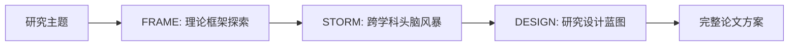

# Phase 04: FULL 模式 — 端到端全流程

> **取向覆盖条款（优先于本文件其余默认项）**：FULL 开始前确认研究取向，混合研究另确认主路径、次路径和互证关系；该选择贯穿 FRAME → STORM → DESIGN。各阶段顾问按风险调度，不沿用原文固定三/五顾问。Stage Gate 1–3 按已选取向验收：理论、规范和阐释路径不要求变量、功效或回归。`full-report` 复制 `research_orientation` 与 `analysis_required`；只有后者为 `true` 才交接 analysis，否则交接 lit → outline → write。

## 顾问派发闸门

FULL 模式按 `master/agent-orchestration.md` 在存在实质风险时创建 `paper-workspace/_logs/agents/design-[YYYY-MM-DD]/agent-brief.md`，并在需要复核的 FRAME、STORM、DESIGN 段更新 `agent-synthesis-design-[YYYY-MM-DD].md`。各段按当前风险选择角色；不能并行时记录 `sequential-review`，轻量任务记录 `agent-skip`。

## 触发条件

- 用户明确指定 `full` 模式
- 用户关键词: `全流程`, `全套`, `完整方案`, `从零开始`, `端到端`, `一条龙`
- 用户表示"帮我设计一个完整的研究方案"

## 输入要求

| 字段 | 必需 | 说明 |
|------|------|------|
| 研究主题 | 是 | 具体的研究现象或话题 |
| 学科领域 | 推荐 | 若不提供则自动路由 |
| 目标期刊 | 推荐 | 影响各阶段的深度和风格 |
| 数据来源 | 推荐 | 影响 DESIGN 阶段的可行性 |
| 特殊约束 | 否 | 方法偏好、样本限制、时间线等 |

## 全流程概览

按 `master/output-protocol.md`，FULL 报告必须先给出 Mermaid 阶段流程图，再给文字说明：



图后用 2-4 条中文解释说明阶段输入、阶段输出、门控条件和可能回流点。

```
FULL 模式: 从模糊想法到完整研究蓝图

Phase 01: FRAME ────→ Phase 02: STORM ────→ Phase 03: DESIGN
理论框架探索         跨学科头脑风暴          研究设计蓝图
                                                    
输入: 研究主题        输入: FRAME 报告        输入: Top 10 RQs
输出: 理论定位报告    输出: Top 10 RQs        输出: 研究设计蓝图
      + 空白清单            + 理论嫁接方案            + PAP 概要
      + RQ 方向             + 评估评分卡
                            
耗时: ~5-10 min      耗时: ~15-25 min        耗时: ~10-15 min
```

## 执行流程

### Stage 0: 模式锁定、AI 关键词提取与 frame 初筛

进入 FULL 前必须已经完成模式确认并记录 `mode-lock: FULL`。随后先由主流程从研究主题中提取 3-8 个框架定位关键词，再运行：

```bash
python3 scripts/frame_locator.py --topic "[研究主题]" --keywords "[AI提取关键词，用空格分隔]" --top 3
```

把 AI 提取关键词、候选 frame、相关度分数、命中词、建议精读行号区间和不确定性提示写入 process log，并作为 Stage 1 和 Stage 2 的路由依据。该脚本只做初步定位，后续仍须按 `read_ranges` 行号区间读取 frame 内容并派发 design agents。

### Stage 1: 理论框架探索 → FRAME 报告

**执行**: 完整运行 [Phase 01: FRAME 模式](phases/01-frame-mode.md) 的全部步骤:

1. Python frame 初筛与学科路由确认，取得候选 frame 与 `read_ranges` (Step 1)
2. 按行号区间加载理论框架，必要时扩展相邻段落 (Step 2)
3. 理论定位 — 五维评估 (Step 3)
4. 研究空白识别 — 四类空白 (Step 4)
5. 输出理论定位报告 (Step 5)

**输出文件**: `paper-workspace/01-design/frame-report-[discipline]-[slug]-[date].md`

**阶段门控 (Stage Gate 1)**:
- [ ] FRAME 报告所有六个章节完整
- [ ] 至少识别 5 个候选理论和 5 个研究空白
- [ ] 推荐的 RQ 方向有明确的理论依据

**通过后进入 Stage 2。**

---

### Stage 2: 跨学科头脑风暴 → STORM 报告

**执行**: 完整运行 [Phase 02: STORM 模式](phases/02-storm-mode.md) 的全部步骤:

1. 多框架加载 (Step 1)
2. 跨学科交叉扫描 — 四维度 (Step 2)
3. 理论嫁接 — 五种策略 (Step 3)
4. 研究问题生成 — 六种策略，15-20 个候选 RQs (Step 4)
5. 多智能体并行评估 — 五个代理 (Step 5)
6. RQ 精炼 (Step 6)
7. 输出 Top 10 RQs 报告 (Step 7)

**输入**: Stage 1 的 FRAME 报告 (理论定位 + 空白清单 + RQ 方向)

**输出文件**: `paper-workspace/01-design/storm-report-[slug]-[date].md`

**阶段门控 (Stage Gate 2)**:
- [ ] STORM 报告所有七个章节完整
- [ ] 多智能体评估全部完成
- [ ] FATAL FLAW RQ 已剔除
- [ ] Top 10 RQs 每个都有完整的理论嫁接来源和变量指定

**通过后进入 Stage 3。**

---

### Stage 3: 研究设计 → DESIGN 报告

**执行**: 完整运行 [Phase 03: DESIGN 模式](phases/03-design-mode.md) 的全部步骤:

1. 理论锚点确认 (Step 1)
2. 研究设计生成 — 范式/识别策略/操作化/功效分析 (Step 2)
3. 理论-方法一致性检查 — 七项对齐 (Step 3)
4. 输出研究设计蓝图 (Step 4)

**输入**: 
- Stage 2 的 Top 10 RQs (用户或系统选定 1-2 个核心 RQ 进行设计)
- FRAME 报告中的理论锚点和机制链条

**输出文件**: `paper-workspace/01-design/design-report-[slug]-[date].md`

**阶段门控 (Stage Gate 3)**:
- [ ] DESIGN 报告所有章节完整
- [ ] 理论-方法对齐检查七项全部通过或已有修正方案
- [ ] 稳健性方案覆盖至少 4 种威胁

---

### Stage 4: 全流程方案合并

将三个阶段的所有输出合并为完整的论文方案:

**输出文件**: `paper-workspace/01-design/full-report-[slug]-[date].md`

#### 合并报告结构

```
# FULL 报告: [研究主题] — 完整论文方案

## 第一部分: 理论框架 (来自 FRAME)
### 1.1 研究主题与学科定位
### 1.2 理论框架总览
### 1.3 理论定位矩阵
### 1.4 研究空白清单
### 1.5 推荐研究方向

## 第二部分: 研究问题 (来自 STORM)
### 2.1 跨学科交叉扫描矩阵
### 2.2 理论嫁接方案
### 2.3 多智能体评估共识
### 2.4 Final Top 10 Research Questions

## 第三部分: 研究设计 (来自 DESIGN)
### 3.1 理论锚点与机制链条
### 3.2 研究设计概览
### 3.3 变量操作化
### 3.4 实证模型设定
### 3.5 功效分析
### 3.6 理论-方法对齐检查
### 3.7 稳健性方案
### 3.8 预分析计划概要

## 第四部分: 执行路线图
### 4.1 研究阶段与时间线
### 4.2 关键决策节点
### 4.3 风险与应对方案
```

---

## 时间与资源估算

| 阶段 | 预计耗时 | 关键资源 |
|------|---------|---------|
| FRAME | 5-10 min | Frame 文件 (单学科读取) |
| STORM | 15-25 min | Frame 文件 (多学科) + 5 个 Agent 并行 |
| DESIGN | 10-15 min | 自主设计 |
| 合并 | 2-3 min | 报告拼接 + 交叉引用一致性 |
| **总计** | **~30-50 min** | **完整论文方案** |

---

## 阶段间依赖与数据流

```
用户输入 (研究主题)
    │
    ▼
[Stage 1: FRAME]
    │
    ├──→ 理论定位矩阵 ──→ [Stage 2: STORM]
    ├──→ 研究空白清单 ──→ [Stage 2: STORM]    
    └──→ RQ 方向建议 ──→ [Stage 2: STORM]
                              │
                              ├──→ Top 10 RQs ──→ [Stage 3: DESIGN]
                              ├──→ 理论嫁接方案 ──→ [Stage 3: DESIGN]
                              └──→ 评估评分卡 ──→ [Stage 3: DESIGN]
                                                        │
                                                        └──→ [Stage 4: 合并]
                                                                  │
                                                                  └──→ 完整论文方案
```

---

## 弹性执行选项

### 选项 A: 用户在每个阶段门控处确认

在 Stage Gate 1 和 Stage Gate 2 暂停，向用户呈现阶段结果，获取确认后继续。适合用户需要精细控制的研究设计。

### 选项 B: 自动流水线 (默认)

三个阶段自动连续执行，仅在 FULL 流程完成后呈现完整方案。适合用户信任系统判断的场景。

### 选项 C: 跳过特定阶段

如果用户已有部分输出:
- `full --skip-frame`: 仅当用户提供可追溯理论框架和 frame 来源时，才能跳过 Stage 1。
- `full --skip-storm`: 仅当用户提供候选 RQs、理论嫁接来源和评估依据时，才能跳过 Stage 2。
- `full --design-only`: 仅当用户提供完整理论锚点、核心 RQ、变量/材料和方法偏好时，才能仅执行 Stage 3。

任何跳过都必须写明原因，并保留 mode-lock；不得因主流程自行判断而无故跳跃。

---

## FULL 模式质量检查

完成前自检:
- [ ] 三个阶段报告均已保存
- [ ] 每个阶段门控均已通过
- [ ] 合并报告包含所有四大部分
- [ ] 理论与 RQ 之间可追溯 (每个 RQ → 嫁接方案 → 源理论)
- [ ] RQ 与研究设计之间一致 (RQ 指定的变量出现在设计模型中)
- [ ] 跨阶段引用一致 (理论名、变量名统一)
- [ ] 完整的论文方案具有可操作性 (非学术空谈)
- [ ] 执行路线图有合理的时间估算
