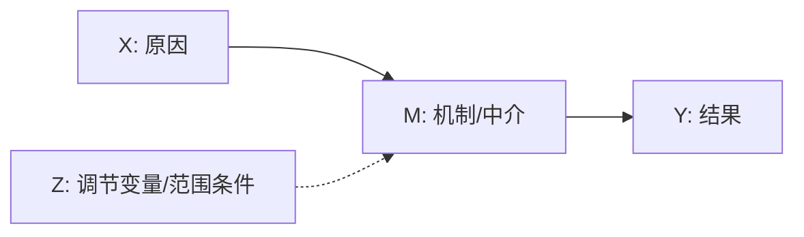

# Phase 3：理论框架与假设推导

## 顾问派发闸门

进入假设推导前，必须派发 `modules/lit/agents/hypothesis-bridge-consultant.md`，检查空白、理论框架、机制链条和假设表述是否连贯。顾问意见写入 `paper-workspace/_logs/agents/lit-[YYYY-MM-DD]/hypothesis-bridge-consultant.md`，并由主流程更新 `agent-synthesis-lit-[YYYY-MM-DD].md` 后再输出假设。

由 `lit module/SKILL.md` **仅模式D** 加载。从文献空白出发，选择理论框架、明确机制、推导可检验假设。

---

## 3a. 理论框架评估

给定 Phase 2 识别的空白，评估哪些理论框架能生成预测：

| 框架 | 对空白的核心预测 | 适配度 | 适配或不适配的原因 |
|------|----------------|--------|------------------|
| [名称] | [对X→Y的预测] | 高/中/低 | [机制匹配、范围匹配] |

**必须包含：**
- 本子领域最常用的1-2个框架（确立基线）
- 来自不同理论传统的1个框架（结构 vs 文化、宏观 vs 微观、西方 vs 非西方如适用）
- 明确说明标准框架是否**不足**——这通常就是理论贡献所在

### 框架加载流程

1. **加载路由索引**：先 Read `modules/lit/references/theory-frameworks.md`，根据研究主题关键词匹配路由表，确定 1-3 个最相关学科
2. **按需加载学科框架**：根据路由结果，Read 对应的 `modules/design/frame/theory-frameworks-[discipline].md` 文件（路径：`modules/design/frame/`）
3. **六维度评估**：每个框架文件均包含六维度模板——核心主张、机制链条、实证证据、竞争/替代理论、关键论文、理论地位。利用这些维度进行深度的适配度评估
4. **跨学科时**：主学科全文加载，辅助学科加载相关章节（按章节标题定位）

**框架评估表示例**（利用六维度信息填充）：

| 框架 | 核心主张（对空白） | 机制链条 | 实证支持力度 | 竞争框架 | 适配度 |
|------|-------------------|---------|------------|---------|--------|
| [名称] | [从核心主张+机制维度] | [从机制链条维度] | [从实证证据+理论地位维度] | [从竞争理论维度] | 高/中/低 |

路由索引及加载指令详见 [theory-frameworks.md](modules/lit/references/theory-frameworks.md)。

---

## 3b. 选择框架并构建论点

选择**一个主框架**（最多一个辅助框架）。论证：

1. **为什么该框架适合此空白**：命名空白类型（来自 Phase 2h）并展示框架如何直接解决
2. **为什么竞争框架不足**：命名1-2个竞争对手，解释它们对*这一具体问题*的局限（非泛泛的局限）
3. **拓展还是应用**：这是直接应用、边界条件检验还是真正的理论拓展

**框架论证模板：**
> "我们借鉴[理论X]（作者 年份）来解释[结果Y]。[理论X]认为[核心主张]，预测[机制M]连接[X]到[Y]。[理论X]的先前应用聚焦于[先前范围]；我们将此论证拓展到[新人群/情境/机制]，因为[实质性原因]。"

**合成论证**（当现有框架均不充分时）：
> "既非[理论A]也非[理论B]能充分解释[空白]，因为[理论A]假设[X]而[理论B]假设[Y]。我们提出需要[新机制或整合]来解释[结果]，结合[A的元素]与[B的元素]在[范围条件]下。"

详见 [gap-to-hypothesis.md](modules/lit/references/gap-to-hypothesis.md)。

---

## 3c. 明确机制

将因果链显式化、可检验化。

**机制陈述格式：**
> "[X]导致[Y]是因为[机制M]，通过[过程P]运作，在[范围条件C]下。"

**机制图（必须使用 Mermaid）：**

图后用 2-4 条中文解释说明 X、M、Y、Z 的文献依据、机制类型和证据缺口。

**机制类型**（明确属于哪种）：
- **资源/物质型**：金钱、时间、基础设施、信息的获取
- **网络/关系型**：接触、扩散、中介、封闭
- **制度/行政型**：规则、把关、官僚负担
- **文化/认知型**：意义、规范、污名、图式
- **心理型**：压力、身份威胁、效能感
- **空间型**：距离、隔离、地方性约束

**范围条件**（机制应在何处、何时、对谁成立）：
- 人群：哪些群体最强烈地经历该机制？
- 情境：在何种制度/历史/地理条件下？
- 阈值：是否存在剂量-反应或非线性关系？

---

## 3d. 推导假设

写出2-4个假设，必须满足：
- **推导而来**：陈述为来自命名理论和机制——非无理论
- **方向性**：预测正向、负向或曲线方向
- **可证伪**：可用可观测变量明确化
- **新颖**：如预测已充分确立，框架为拓展或范围条件
- **可追溯**：每条假设必须通过完整链条追溯：文献空白→框架→机制→预测

### 推导链表（必须完成）

| H# | 文献空白（来自2h） | 空白类型 | 框架预测（来自3b） | 机制链接（来自3c） | 假设陈述 |
|----|-------------------|---------|-------------------|-------------------|---------|
| H1 | "[发现X]已确立但[缺失什么]" (作者 年份) | 人群/机制/识别/争论 | "[框架]预测[方向]因为[解决空白的核心主张]" | "[X→M→Y链中的具体步骤]" | "H1：[正式陈述]" |
| H2 | "[机制M]已提出但未检验" (作者 年份) | 机制 | "[框架]预测M中介X→Y因为[逻辑]" | "[M是3c中识别的中介过程]" | "H2：[中介陈述]" |

**推导链规则**：如果任一列无法填写，假设即未从文献-理论管道中扎根。要么追溯完整路径，要么放弃该假设。每条假设的支撑文献必须是 `02-literature/paper-registry.csv` 中 `reading_status=read` 且有原文定位（页码/章节/可定位段落）的条目；仅有摘要支持的条目只能引出方向性预期，不得支撑机制链接。

**该表防止的常见失败：**
- **通用理论应用**："框架预测"列强制你陈述框架的*哪个具体主张*解决*这个具体空白*——不仅仅是框架"预测"该方向
- **漂浮机制**："机制链接"列强制每条H指向3c中X→M→Y链的具体步骤
- **文献-理论脱节**："文献空白"列强制每条H追溯到文献综述发现的真实缺失

### 假设格式

**主效应（来自机制）：**
> H1：X与Y在[人群]中[正/负]相关，因为[来自3c的机制M]。

**中介（机制检验）：**
> H2：X与Y的关联部分被[中介M，来自3c]解释，与[机制名称]解释一致。

**调节/异质性（范围条件）：**
> H3：X对Y的[正/负]效应在[群体A]中强于[群体B]，因为[来自3c的范围条件]。

**竞争预测（裁决框架间争论）：**
> H4（理论A预测）：[方向1]。H4'（理论B预测）：[方向2]。我们的设计可区分二者。

### 假设汇总表

| # | 陈述 | 方向 | 解决的空白 | 理论基础 | 机制链接 |
|---|------|------|----------|---------|---------|
| H1 | [完整陈述] | [+/−] | [哪条空白] | [理论, 作者 年份] | [3c中的哪个机制步骤] |
| H2 | [完整陈述] | [+/−] | [哪条空白] | [理论, 作者 年份] | [中介/调节 来自3c] |

---

## 3e. 陈述替代解释

为每条假设命名主要竞争预测，并说明设计或数据如何区分：

| 假设 | 我们的预测 | 替代预测 | 设计如何区分 |
|------|----------|---------|------------|
| H1 | [方向，理论A] | [竞争方向，理论B] | [控制变量 / 外生变异 / 子样本检验] |

写出1-2个应对最可能混淆因素的稳健性检验。

---

## 3f. 假设呈现模式

| 目标期刊 | 默认模式 | 原因 |
|---------|---------|------|
| ASR / AJS / 管理世界 | 融合式 | 主题子节内交织文献+理论+假设 |
| Demography | 分离式（≥3H时融合式） | 简洁概念框架 |
| NHB / Science Advances | 分离式-预测 | 自然语言预测，无编号H1/H2标签 |
| 语言类期刊（Language in Society等） | 整合-RQ | 无正式H标签；理论期望融入主题文献子节；以"The Present Study"子节收尾 |

推导完成的假设包落盘为 `paper-workspace/02-literature/hypothesis-derivation.md`（实证假设路径；理论、规范与阐释路径按取向元数据并入相应理论对话材料），供 outline 与 write 直接承接。
