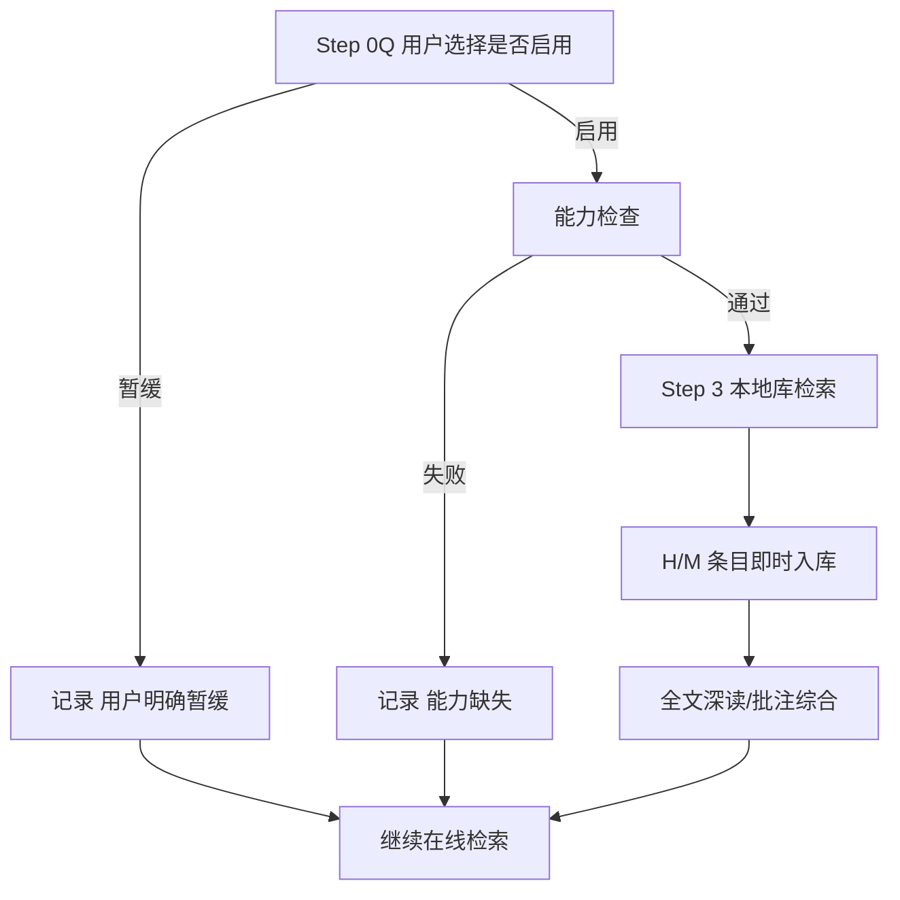

# zotero-local-mcp 文献工作流协议

本文件是 lit 模块在用户启用 Zotero MCP 后的操作协议。安装、授权与验收命令见 [install-dependencies.md](install-dependencies.md)。推荐实现：`zotero-local-mcp`（Zotero 10 本地 API，`http://localhost:23119/api/`）。其他 Zotero MCP 实现只要通过同一验收口径，可按各自工具名对照执行。

宿主工具名可能带前缀（如 `mcp__zotero__zotero_search_items`）。本协议只使用规范工具名；调用前按当前宿主实际暴露的工具列表匹配，不得假设固定前缀。



- 启用与否由用户在 Phase 0/Step 0Q 决定；未启用不得安装或写入 Zotero。
- 能力检查失败只关闭本地库与全文保存，不替代 CNKI / Scholar。
- 正式纳入仍以摘要或等价全文摘要为准；Zotero 条目不能单凭标题准入。

---

## 1. 定位与边界

| 项 | 约定 |
|---|---|
| 角色 | 可选增强：本地文献库检索、题录/摘要保存、附件深读、集合整理 |
| 存储 | 附件写入本机 Zotero `storage/<key>/`，不经 Zotero 官方云端存储转发 |
| 同步 | WebDAV 或官方同步由 Zotero 桌面端执行；MCP 不直连同步服务 |
| 授权 | `POST /api/local/authorize`；密钥在 `~/.config/pyzotero/local-api-key.json`（`0600`） |
| 删除 | `zotero_delete_item` 移入回收站，不物理删除 |
| 不替代 | 不能替代摘要准入、CNKI kns8s 闭环、Google Scholar/exa 检索完成状态 |

**不要**配置 `ZOTERO_API_KEY` / `ZOTERO_LIBRARY_ID`。残留云端凭据会使写入走错误路径。

---

## 2. 启用闸门与能力检查

仅当 Step 0Q 记录为启用时执行。检查顺序：

1. Zotero Desktop 正在运行，且已勾选「允许本机上的其他应用程序与 Zotero 通信」。
2. 当前宿主工具列表中能匹配到 `zotero_search_items`（或等价检索工具）。
3. 用一个短查询试检索（如当前主题的核心概念词），能返回条目或空结果，而不是连接/授权错误。
4. 需要全文深读时，再试 `zotero_get_item_fulltext` 或 `zotero_get_pdf_outline` 于一篇已有 PDF 的条目。

状态词表：

| 状态 | 含义 | 后续 |
|---|---|---|
| `Zotero MCP 正常` | 检索可用；按需全文可用 | 进入 Step 3 与即时入库 |
| `Zotero MCP 只读` | 能检索/读元数据，不能 `zotero_add_item` | 本地匹配可用；新条目写入待补存清单 |
| `能力缺失` | 未安装、Zotero 未运行、授权失败或工具未暴露 | 记录后继续在线检索 |
| `用户明确暂缓` | Step 0Q 未启用 | 跳过本协议全部写入与检索 |

MCP 工具不可用但 `zotero-cli` 可用时，可用 CLI 做等价操作（`zotero-cli --json search`、`zotero-cli add doi`、`zotero-cli get metadata <KEY>`），状态仍记 `Zotero MCP 正常` 并在日志注明 `via CLI`。

---

## 3. 工具到 lit 阶段映射

| lit 阶段 | 用途 | 优先工具 | 备注 |
|---|---|---|---|
| Phase 0 能力检查 | 确认本地库可达 | `zotero_search_items` | 短查询即可 |
| Step 3 主题检索 | 已有文献匹配 | **先** `zotero_semantic_search`，再 `zotero_search_items` | 语义检索适合主题；子串检索适合作者/年份/题名 |
| Step 3 精确查找 | 作者年、DOI、citekey | `zotero_search_items`（`titleCreatorYear`）、`zotero_search_by_citation_key` | 查询保持短；多词会收窄 |
| Step 3 集合/标签 | 项目文库切片 | `zotero_search_collections`、`zotero_get_collection_items`、`zotero_search_by_tag` | 有项目集合时先扫集合 |
| 摘要核验 | 读 abstractNote | `zotero_get_item_metadata` | `include_abstract=true` |
| 全文深读 | PDF/EPUB | 先 `zotero_get_pdf_outline`，再 `zotero_read_pdf_pages`；确需通读才 `zotero_get_item_fulltext` | 扫描件可能无文本 |
| 即时入库 | 新建题录 | `zotero_add_item` | 必须带 `abstractNote` |
| 挂 PDF | 本地文件 | `zotero_attach_file` | 文件已在 `papers/` 或用户路径 |
| 项目集合 | 归入本次论文 | `zotero_create_collection`、`zotero_set_item_collections` | 集合名用项目 slug，不写个人信息 |
| Phase 2 | 已有高亮/笔记 | `zotero_get_annotations`、`zotero_synthesize_annotations`、`zotero_get_notes` | 只作证据线索，仍要回查原文 |
| 书目导出 | 交接 write/submission | `zotero_export_bibliography` | 体例由 submission 最终裁定 |
| 误写入 | 撤销测试/噪音条目 | `zotero_delete_item` | 进回收站 |

高级检索（日期、itemType、多字段 AND/OR）用 `zotero_advanced_search`。跨个人库与群组库时，检索类工具可设 `search_all_libraries=true`（需 sqlite 后端）。

---

## 4. Phase 1 Step 3：本地库检索

用户启用且能力检查通过后，按 Step 1 精炼的中英文检索词执行，不得用宽泛自然语言一次扫全库后直接纳入。

1. **语义轮**：对每个已确认方向，用 `zotero_semantic_search`（limit 10–20）。若工具不可用，记 `semantic_search=能力缺失`，改子串检索。
2. **子串轮**：对作者、年份、专名、种子题名用 `zotero_search_items`；查询短而具体（`Author Year` 或单一专名）。
3. **去重**：与 `paper-registry.csv` 按 DOI、规范化「题名+作者+年份」或已有 `source_id`（Zotero item key）去重。
4. **摘要门槛**：无 `abstractNote` 且无法从附件提取等价摘要的条目，只进待核验，相关度不得标 H/M 正式纳入。
5. **深读**：种子文献或 H 档且有 PDF 时，先读大纲再按页读取；不要默认抽取全书。

日志来源标签：`zotero-local-mcp`。每轮追加搜索日志，并写入命中总数、有摘要数、待核验数。

---

## 5. 摘要即时入库

对每篇正式清单中相关度 H 或 M、且来自 CNKI / Scholar / WebSearch / 本地新发现的论文：抓取摘要后**立即**入库，禁止检索全部结束后批量补存。

推荐调用：

```text
zotero_add_item
  source: DOI 或 URL（优先 DOI）
  collections: 本次项目集合 key（若已创建）
  tags: [paper-master, <项目slug>]
  if_exists: file
```

无 DOI 时可用 bibtex / csl_json；中文作者与集刊规则见 [install-dependencies.md](install-dependencies.md)「中文文献导入注意点」。

写入后：

1. 把返回的 8 位 `item_key` 记入搜索日志论文清单。
2. 注册表：`--source zotero-local-mcp --source-id <item_key>`；`notes` 可写 `zotero_item_key=<item_key>`。
3. 失败则写入 `paper-workspace/02-literature/abstracts-pending-zotero.md`，状态 `Zotero 不可用，摘要未保存` 或 `Zotero MCP 只读`。

已有条目不要重复创建：先 `zotero_search_items` / DOI 匹配，命中则 `zotero_update_item` 补 `abstractNote`、集合和标签。

---

## 6. 全文深读

| 步骤 | 工具 | 规则 |
|---|---|---|
| 找附件 key | `zotero_get_item_children` | 批注/大纲/区域框选需要附件 key，不是父条目 key |
| 定向阅读 | `zotero_get_pdf_outline` → `zotero_read_pdf_pages` | 先大纲后页码 |
| 通读 | `zotero_get_item_fulltext` | 仅用户明确要求读全文，或页码未知且论文不长 |
| 本机路径 | `zotero_get_attachment_path` | 大文件或需交给 MinerU 时使用；不搬移用户原文件 |

项目内归档仍走 `literature_registry.py` 与 `papers/`；Zotero storage 路径只登记为 `source_pdf_path`，不复制进 skill 包。

---

## 7. 集合、标签与注册表

- 可为当前论文项目建集合，名称用工作区 slug 或用户给定题目，避免写入个人姓名、邮箱、账户。
- 正式纳入条目加标签 `paper-master`；可选加模式标签（`lit-A` 等）。
- `paper-registry.csv` 仍是项目内唯一身份表；Zotero key 只是外部交叉索引。
- 不得把 Zotero 库清单直接当作 Phase 2 证据表。

---

## 8. Phase 2 批注综合

若用户已在 Zotero 中高亮或做笔记：

1. `zotero_synthesize_annotations` 或按条目 `zotero_get_annotations` 收集高亮与笔记。
2. 高亮只作为原文定位线索，写入 `review-evidence.csv` 前必须能指回页码或引文。
3. 无文本层的扫描 PDF 不能当已核摘要。

---

## 9. 删除与安全

- 测试条目、明显误导入条目用 `zotero_delete_item` 进回收站。
- 不得调用硬删除；恢复在 Zotero 桌面端「回收站」完成。
- 不读取、不上传、不写入用户 API key、cookie 或账户邮箱到 `paper-workspace/`。

---

## 10. 不可替代规则

- WebSearch、exa、顾问意见不得标记为 `Zotero MCP 正常`。
- 空结果不是失败；连接错误、401/403、本地 API 未开启才是 `能力缺失`。
- 本协议不改变 CNKI「浏览器控制 + Cookie/curl」下载铁律。
- 无摘要条目不得因「已在 Zotero」而进入文献地图。

---

## 11. 验证

```bash
# 桌面端本地 API
curl -s -o /dev/null -D - http://localhost:23119/api/ | head

# CLI（若已安装）
zotero-cli --json config
zotero-cli --json search "test" --limit 1
```

宿主侧：能调用 `zotero_search_items`；启用写入时能对测试条目执行 `zotero_add_item` 并回收站删除。
