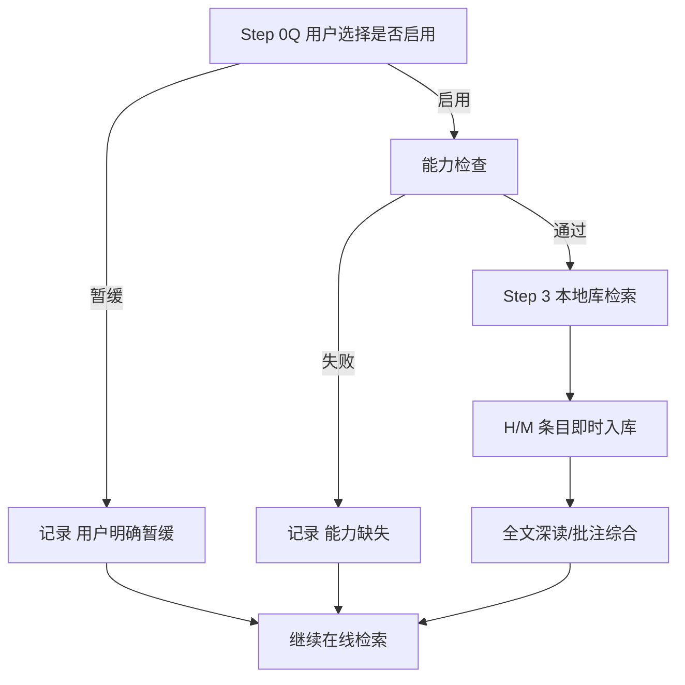
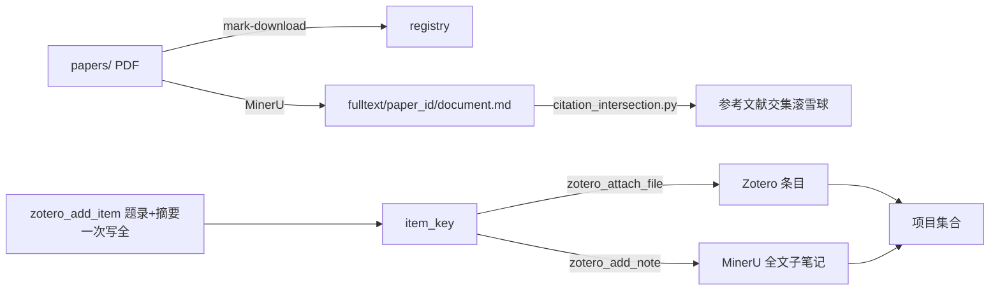

# zotero-local-mcp 文献工作流协议

本文件是 lit 模块在用户启用 Zotero MCP 后的操作协议。安装与验收见 [install-dependencies.md](install-dependencies.md)。**推荐实现：`zotero-agent` MCP 插件（v0.5.0+，34 个 `zotero_*` 工具）**——运行在 Zotero 进程内，能力是 Zotero 本地 API 的超集；一切 Zotero 操作走该插件工具，**禁止**直接调用 `http://127.0.0.1:23119/api/**` 或 `/connector/**`（写操作需弹窗授权/一次性 key，历史上造成过通道混乱与返工）。其他 Zotero MCP 实现只要通过同一验收口径，可按各自工具名对照执行。

宿主工具名可能带前缀（如 `mcp__zotero-agent__zotero_search`）。本协议只使用规范工具名；调用前按当前宿主实际暴露的工具列表匹配，不得假设固定前缀。


```mermaid
flowchart TD
  A[Step 0Q 用户选择是否启用] -->|暂缓| Z[记录 用户明确暂缓]
  A -->|启用| B[能力检查]
  B -->|失败| C[记录 能力缺失]
  B -->|通过| D[Step 3 本地库检索]
  D --> E[H/M 条目即时入库]
  E --> F[全文深读/批注综合]
  C --> G[继续在线检索]
  Z --> G
  F --> G
```

- 启用与否由用户在 Phase 0/Step 0Q 决定；未启用不得安装或写入 Zotero。
- 能力检查失败只关闭本地库与全文保存，不替代 CNKI / Scholar。
- 正式纳入仍以摘要或等价全文摘要为准；Zotero 条目不能单凭标题准入。

---

## 1. 定位与边界

| 项 | 约定 |
|---|---|
| 角色 | 可选增强：本地文献库检索、题录/摘要保存、附件深读、集合整理 |
| 存储 | 附件写入本机 Zotero `storage/<key>/`，不经 Zotero 官方云端存储转发 |
| 同步 | WebDAV 或官方同步由 Zotero 桌面端执行；MCP 不直连同步服务 |
| 授权 | 插件令牌（Zotero 设置 → Zotero-Agent-MCP 面板复制）；无云端 API key |
| 删除 | `zotero_delete_item` 默认移入回收站（`permanent=true` 才硬删，默认禁用） |
| 不替代 | 不能替代摘要准入、CNKI kns8s 闭环、Google Scholar/exa 检索完成状态 |

**不要**配置 `ZOTERO_API_KEY` / `ZOTERO_LIBRARY_ID`（云端凭据），也**不要**走本地 API v3 直写（Server-ID + authorize 配方已废弃）。

---

## 2. 启用闸门与能力检查

仅当 Step 0Q 记录为启用时执行。检查顺序（不要只验检索）：

1. `zotero_ping`：插件在线，`version ≥ 0.5.0`，`scopes.write = true`。
2. 按本任务所需**写工具**逐项核对：要建集合 → `zotero_create_collection` 在工具列表；要改元数据 → `zotero_update_item` 在列；要入库 → `zotero_get_schema` 可取字段名。
3. 用一个短查询试检索（如当前主题的核心概念词），能返回条目或空结果，而不是连接/授权错误。
4. 需要全文深读时，再试 `zotero_get_fulltext` 于一篇已有 PDF 的条目。

状态词表：

| 状态 | 含义 | 后续 |
|---|---|---|
| `Zotero MCP 正常` | 检索可用；写工具齐备 | 进入 Step 3 与即时入库 |
| `Zotero MCP 只读` | 能检索/读元数据，write 作用域关闭 | 本地匹配可用；新条目写入待补存清单 |
| `能力缺失` | 未安装、Zotero 未运行、401/403 或工具未暴露 | 记录后继续在线检索，**不得绕行本地 API** |
| `用户明确暂缓` | Step 0Q 未启用 | 跳过本协议全部写入与检索 |

工具缺失时停下向用户报告（如"插件版本过旧，缺 zotero_update_item"），由用户升级插件；不要自行发明替代通道。

---

## 3. 工具到 lit 阶段映射（zotero-agent v0.5.0，34 工具）

| lit 阶段 | 用途 | 优先工具 | 备注 |
|---|---|---|---|
| Phase 0 能力检查 | 确认插件与作用域 | `zotero_ping` | 见 §2 |
| Step 3 主题检索 | 已有文献匹配 | `zotero_search`（mode=everything 走全文索引） | 无语义检索；everything 适合作主题 |
| Step 3 精确查找 | 作者年、DOI | `zotero_search`（默认标题/作者/年份）、`zotero_get_item` | 查询保持短；多词会收窄 |
| Step 3 集合/标签 | 项目文库切片 | `zotero_search_collections`、`zotero_get_collection_items`、`zotero_search`（tag 参数） | 有项目集合时先扫集合 |
| 摘要核验 | 读 abstractNote | `zotero_get_item` | 返回含全部字段 |
| 全文深读 | PDF/EPUB | `zotero_get_fulltext`（`offset`/`max_chars` 分页） | 扫描件可能无文本层 |
| 即时入库 | 新建题录 | `zotero_add_item`（纯元数据一次写全） | **fields 含 abstractNote**，见 §5 |
| 补/改元数据 | 卷期页、作者、期刊 | `zotero_update_item` | 写完检查 `skippedFields` |
| 挂 PDF | 本地文件 | `zotero_attach_file` | import 复制入 storage；文件已在 `papers/` 或用户路径 |
| MinerU 全文笔记 | md → 子笔记 | `zotero_add_note`（查重用 `zotero_get_children`） | 见 §5b，纯文本骨架 |
| 项目集合 | 归入本次论文 | `zotero_create_collection`、`zotero_set_item_collections`（mode=add） | 集合名用项目 slug，不写个人信息 |
| Phase 2 | 已有高亮/笔记 | `zotero_get_annotations` | 综合由 agent 完成；只作证据线索，仍要回查原文 |
| 书目导出 | 交接 write/submission | `zotero_cite` | CSL 样式＋bibtex/ris/csljson 等 10 格式 |
| 误写入 | 撤销测试/噪音条目 | `zotero_delete_item` | 默认进回收站 |
| 回收站 | 查误删/恢复 | `zotero_get_trash`、`zotero_update_item {deleted:false}` | |

辅助：字段名自省 `zotero_get_schema`；跨会话增量 `zotero_versions`；附件本地路径 `zotero_get_attachment_path`；库级标签 `zotero_get_tags`/`zotero_delete_tags`；保存检索 `zotero_create_search`/`zotero_run_search`；全文索引写 `zotero_set_fulltext`。

---

## 4. Phase 1 Step 3：本地库检索

用户启用且能力检查通过后，按 Step 1 精炼的中英文检索词执行，不得用宽泛自然语言一次扫全库后直接纳入。

1. **全文轮**：对每个已确认方向，用 `zotero_search` mode=everything（limit 10–20）。
2. **子串轮**：对作者、年份、专名、种子题名用 `zotero_search`（默认标题/作者/年份模式）；查询短而具体（`Author Year` 或单一专名）。
3. **去重**：与 `paper-registry.csv` 按 DOI、规范化「题名+作者+年份」或已有 `source_id`（Zotero item key）去重。
4. **摘要门槛**：无 `abstractNote` 且无法从附件提取等价摘要的条目，只进待核验，相关度不得标 H/M 正式纳入。
5. **深读**：种子文献或 H 档且有 PDF 时，`zotero_get_fulltext` 分页读取；不要默认抽取全书。

日志来源标签：`zotero-local-mcp`（历史标签，指"Zotero 通道"；现由 zotero-agent 插件实现）。每轮追加搜索日志，并写入命中总数、有摘要数、待核验数。

---

## 5. 摘要即时入库

对每篇正式清单中相关度 H 或 M、且来自 CNKI / Scholar / WebSearch / 本地新发现的论文：抓取摘要后**立即**入库，禁止检索全部结束后批量补存。

推荐调用（纯元数据一次写全，无需本地文件）：

```text
zotero_add_item
  item_type: journalArticle（按实际）
  title: <题名>
  fields: { abstractNote: <摘要>, date: <年>, publicationTitle: <期刊>, volume, issue, pages, DOI }
  creators: [{name:'中文作者'}] / [{firstName, lastName}]
  collections: [<本次项目集合 key 或名>]
  tags: [paper-master, <项目slug>]
```

中文作者单字段用 `{name}`，西文用 `{firstName,lastName}`；不确定字段名先 `zotero_get_schema`。写入后检查返回的 `skippedFields`（无效字段被静默跳过）。

写入后：

1. 把返回的 8 位 `item_key` 记入搜索日志论文清单。
2. 注册表：`--source zotero-local-mcp --source-id <item_key>`（标签沿用历史值）；`notes` 可写 `zotero_item_key=<item_key>`。
3. 失败则写入 `paper-workspace/02-literature/abstracts-pending-zotero.md`，状态 `Zotero 不可用，摘要未保存` 或 `Zotero MCP 只读`。

已有条目不要重复创建：先 `zotero_search` / DOI 匹配，命中则 `zotero_update_item` 补 `abstractNote`、集合和标签（collections 为全量替换语义，保留原分类用 `zotero_set_item_collections` mode=add）。

---

## 5b. PDF 入集合与 MinerU 全文笔记（Step 11）

用户启用 Zotero 且 Top-N 全文化完成后执行：

1. **项目集合自动创建**：`zotero_search_collections(query=<项目slug>)` 查重；不存在 → `zotero_create_collection(name=<项目slug>)`，key 记入搜索日志；存在 → 复用。不重复建同名集合。子集合可传 `parent`。
2. **挂本地 PDF**：对 `download_status=downloaded` 且已有 `item_key` 的条目，`zotero_attach_file(key=<item_key>, path=<papers/ 绝对路径>)`；默认 import 模式复制入 Zotero storage。无条目的先 `zotero_add_item` 创建（带题录+摘要）。
3. **归集合**：逐条 `zotero_set_item_collections(key, collections=[<集合 key>], mode=add)`（add 保留原分类）；标签 `paper-master`。
4. **MinerU 全文 md → 子笔记**：`zotero_add_note(key=<父条目>, html=<正文骨架>)`。规则：
   - 只放纯文本骨架：去掉图片引用与 base64，标题层级、正文与参考文献完整保留；
   - 超约 80k 字符截断，尾部注明「笔记截断，全文见 fulltext/<paper_id>/document.md」；
   - 创建前 `zotero_get_children(key)` 查重，同名笔记已存在则跳过；
   - 失败记入注册表 `notes=zotero_note=pending`，不阻塞流程。

**写入通道实测结论（2026-09-29，zotero-agent v0.5.0）**：
- 全部走 MCP 工具（`zotero_add_item`/`zotero_attach_file`/`zotero_add_note`/`zotero_set_item_collections`）；真机回归 HTTP 96/96、桥 E2E 56/56（34 工具）。
- **禁止**任何 `urllib/requests/curl` 直写 `/api/users/0/items`：本地 API 写入需弹窗授权与一次性 key，且历史上与 MCP 通道混用造成过建条目无作者后返工（2026-09-27/28 实录）。
- 回查口径：`zotero_get_children(key)`（子附件/子笔记）或 `zotero_get_item(key)`（字段回读），进程内实时无缓存问题。
- 重复尝试会留下重复附件/笔记，收尾逐条目按 `zotero_get_children` 去重（保留最早的一个），并核对附件题名与论文题名一致，防止张冠李戴。


```mermaid
flowchart LR
  P[papers/ PDF] -->|mark-download| R[registry]
  P -->|MinerU| F[fulltext/paper_id/document.md]
  A[zotero_add_item 题录+摘要一次写全] --> K[item_key]
  K -->|zotero_attach_file| Z[Zotero 条目]
  K -->|zotero_add_note| N[MinerU 全文子笔记]
  Z --> C[项目集合]
  N --> C
  F -->|citation_intersection.py| X[参考文献交集滚雪球]
```

## 6. 全文深读

| 步骤 | 工具 | 规则 |
|---|---|---|
| 找附件 | `zotero_get_children` | 返回子附件与子笔记 key |
| 分页阅读 | `zotero_get_fulltext`（`offset`/`max_chars`，接 `nextOffset` 翻页） | 先小窗定位再读长段 |
| 通读 | `zotero_get_fulltext` | 仅用户明确要求读全文，或页码未知且论文不长 |
| 本机路径 | `zotero_get_attachment_path` | 大文件或需交给 MinerU 时使用；不搬移用户原文件 |

项目内归档仍走 `literature_registry.py` 与 `papers/`；Zotero storage 路径只登记为 `source_pdf_path`，不复制进 skill 包。

---

## 7. 集合、标签与注册表

- 可为当前论文项目建集合（`zotero_create_collection`），名称用工作区 slug 或用户给定题目，避免写入个人姓名、邮箱、账户。
- 正式纳入条目加标签 `paper-master`；可选加模式标签（`lit-A` 等）。
- `paper-registry.csv` 仍是项目内唯一身份表；Zotero key 只是外部交叉索引。
- 不得把 Zotero 库清单直接当作 Phase 2 证据表。

---

## 8. Phase 2 批注综合

若用户已在 Zotero 中高亮或做笔记：

1. 按条目 `zotero_get_annotations` 收集高亮与笔记（agent 自行综合归纳）。
2. 高亮只作为原文定位线索，写入 `review-evidence.csv` 前必须能回指页码或引文。
3. 无文本层的扫描 PDF 不能当已核摘要。

---

## 9. 删除与安全

- 测试条目、明显误导入条目用 `zotero_delete_item` 进回收站（默认行为）。
- 不得传 `permanent=true` 硬删除，除非用户明确要求；恢复用 `zotero_update_item {deleted:false}` 或 Zotero 桌面端回收站。
- 不读取、不上传、不写入用户令牌、cookie 或账户邮箱到 `paper-workspace/`。

---

## 10. 不可替代规则

- WebSearch、exa、顾问意见不得标记为 `Zotero MCP 正常`。
- 空结果不是失败；连接错误、401/403、插件禁用才是 `能力缺失`。
- 工具缺失不得以本地 API 直写、Connector 保存或"等批量补存"替代——向用户报告，升级插件。
- 本协议不改变 CNKI「浏览器控制 + Cookie/curl」下载铁律。
- 无摘要条目不得因「已在 Zotero」而进入文献地图。

---

## 11. 验证

```bash
# 插件探活（无需令牌；确认 version ≥ 0.5.0、scopes 全开）
curl -s http://127.0.0.1:23119/zotero-agent-mcp/ping
```

宿主侧：工具列表含 34 个 `zotero_*` 工具；启用写入时能对测试条目（标签 `zotero-agent-mcp-e2e`）执行 `zotero_add_item` 并 `zotero_delete_item` 入回收站。
